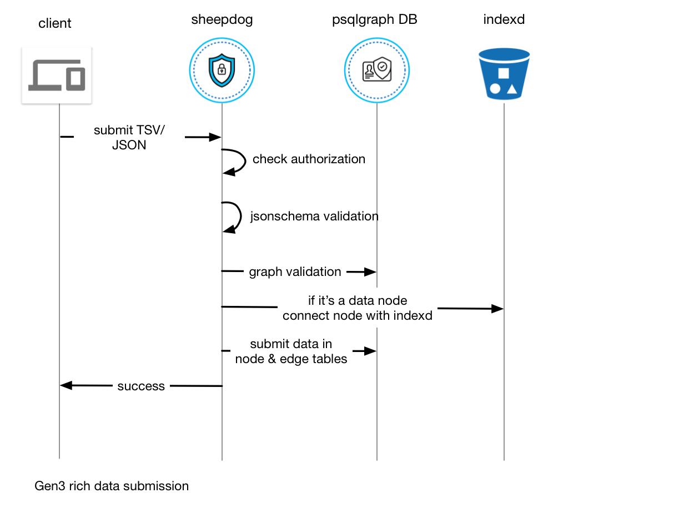
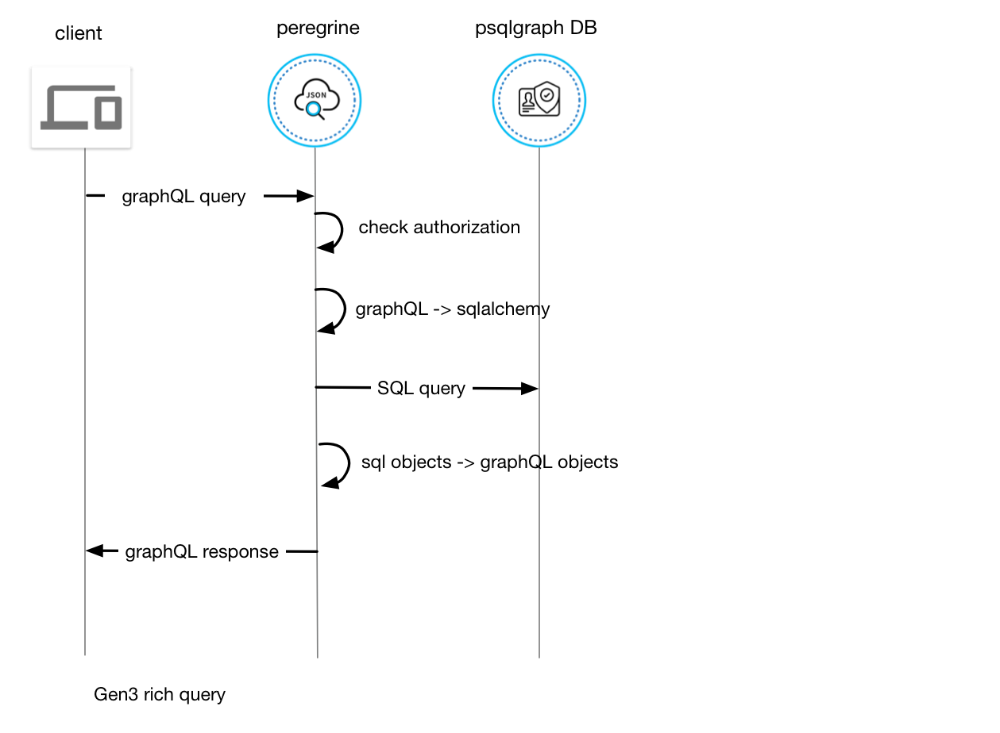
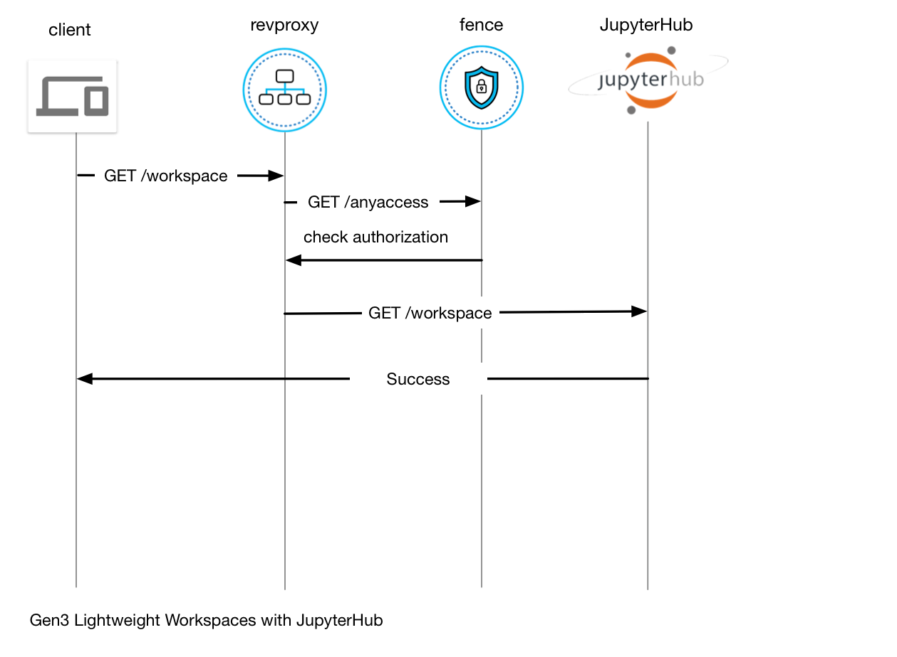

# Gen3 Technical Documentation
This documentation is intended for developers who want to understand the design and architecture of Gen3.

To understand the initiatives of Gen3, go to https://gen3.org

Gen3 software is a set of services that enables users to use the data and compute resources from various cloud providers easily. And on top of those resources, provide a user-friendly environment to organize, query the data and run computational analysis.

## Terminology
### Data Object
Raw data that's not indexed into any database. They are petabyte scale and sit in cloud object storage.

### Rich Data
Data that are harmonized, indexd in various databases, discoverable and queryable.

## Data management

The following diagram describes all the user interactions in data management aspect.

1. fence microservice provides authentication and authorization framework for all Gen3 services & resources.
2. download/upload data. Gen3 doesn't have services sitting between user and cloud storage services so that user can fully leverage the cloud provider's power, but it provides tools and services to enable users to access protected data security with temporary credentials.

3. windmill serves static html, javascript and image files to create a view for users to interact with Gen3 microservices.
4. sheepdog microservice allows user to do rich data submission.
5. peregrine microservice allows user to do GraphQL query on live rich data.
6. indexd microservice allows user to find physical location for data object.
7. gen3-arranger exposes GraphQL query interface for a flattened/materialized view of rich data that's ETLed from graph rich data to Elasticsearch.

### Data Submission System
People generate a lot of data during experiments and studies. They would like to organize the data and annotate the data to describe how they are generated and all the context for the data. All the 'context' is preserved in our 'rich data' database. The rich data store is presented in a graph-like relational model to depict the normalized relationships of all the concepts. Take [bloodpac](https://www.bloodpac.org/data-group/) data model as an example, it describes how you start from having a particular study that's done on a bunch of `cases`( aka patients ), the doctors gathered some clinical informtion about each patient which is kept in various clinical nodes like `diagnosis`, `family history`, etc. The hositpical also gathered some samples from the patient and sent them to sequencing center which finally produced some sequencing files stored in `submitted unaligned reads`.

In order for a Gen3 Commons to preserve these rich data, we first need to come up with a consistent datamodel with standard terminologies to describe all these information. We decided to do the data modeling using jsonschema and store them as yaml files in [github](https://github.com/occ-data/bpadictionary) so it's easy for domain experts to make changes there and track all the data modeling activities. The schema is then translated to database ORM([psqlgraph](https://github.com/NCI-GDC/psqlgraph)) and used by Gen3 microservices to do data validation and database interactions.

The currently supported database backend is postgres, which is not necessarily the optimal choice for complicated graph traversals. But we went with it because of its robustness as a traditional relational database. The data dictionary described in jsonschema is translated to very typical relational datamodel in postgres. Basically every node type is a table and every edge type is a table as the many-to-many proxy between two node tables. The non-conventional schema design is that, all the properties are stored as jsonb in postgres instead of separate columns. This was a compromise to support very frequent data modeling changes required by domain experts with a sacrifise of query performance because of lack of statistics on jsonb.

Sheepdog uses the dictionary-driven ORM to do metadta validation and submission as described in following diagram:
.

Peregrine exposes a query interface for the normalized rich data via GraphQL interface:
.

Separately, users use [cdis-data-client](https://github.com/uc-cdis/cdis-data-client) to request temporary urls to do raw data download/upload:
.

### Data Exploration System
_This is an alpha feature_

After we collect valuable data from various submitters, we would like to expose them in a web UI in a user friendly way. Understanding the datamodel and knowing how to traverse the graph is intimidating for a general Gen3 user, so we created an ETL application - [tube](https://github.com/uc-cdis/tube) to denormalize the graph to several types of flat documents to cater several major use cases.

Tube is driven by configuration files which describe the flat document structure and the mapping logic from the graph model, so that it's generic and can support various datamodels in different commons. For most of the biomedical commons, there are two type of flat documents that satisfies majority of users:
- file-centric document that denormalize biospecimen and clinical attributes for each file. This targets bioinformaticians who wants to filter by specific clinical/biospecimen attributes, and select a bunch of files to run analysis.
- case-centric document that denormalize biospecimen and clinical attributes for each case. This targets clinicians who wants to see distributions based on clinical attributes among cases( AKA patient most of the times ).

[living document for data exploration architecture](https://github.com/uc-cdis/cdis-wiki/tree/master/dev/gen3/data_explorer)

## Workspace Systems

Workspaces are the compute component of a data commons. Workspaces allow users to execute analysis tasks on data without moving the data to another remote environment. Workspaces come in many forms, currently Gen3 integrates what it calls lightweight workspaces. Lightweight workspaces are designed to allow for quick analysis of data, and the creation of workflow jobs in the workflow system.

### Lightweight Workspaces

The following diagram shows the authorization flow for the JupyterHub instances. We utilize the Revproxy and Fence acting as an API gateway for these workspaces. JupyterHub is configured with the [remote user auth plugin](https://github.com/occ-data/jhub_remote_user_authenticator) so that users are authed based on the `REMOTE_USER` header.

JupyterHub is deployed into the default namespace for the commons, but user pods are deployed into the specific `jupyter-pods` namespace to provide an added layer of isolation. This is accomplished using the [Kubespawner](https://github.com/jupyterhub/kubespawner) plugin for JupyterHub. Eventually, users will be deployed into their own Kubernetes namespace so that they can utilize the K8s API to spin up clusters for Spark or Dask. We are tracking issues related to the creation and monitoring of multiple namespaces in Kubespawner [1](https://github.com/jupyterhub/kubespawner/pull/218) [2](https://github.com/jupyterhub/kubespawner/issues/76). We use a [customized JupyterHub](https://github.com/occ-data/containers/tree/master/jupyterhub) which contains additional code to cull idle notebooks after several hours of inactivity. This automatically scales down the cluster again when the notebooks are no longer in use by users.

Notebook servers are configured with persistent storage mounted into `/home/jovyan/pd` for users to store scripts and configurations which they wish to persist past notebook shutdown. In the future we would like to change this to have the storage for the user in the notebook backed by the cloud object storage (S3 or GCS) to improve scalability and the ability to load data into the containers for users.

Currently, we support user selectable notebook containers and resource allocations from a prepopulated list. [Earth science](https://github.com/occ-data/containers/tree/master/jupyter-geo) and [Bioinformatics](https://github.com/occ-data/containers/tree/master/jupyter) notebooks are available with popular libraries preconfigured. 

We also configure a [prepuller daemonset](https://github.com/uc-cdis/cloud-automation/blob/master/kube/services/jupyterhub/jupyterhub-prepuller.yaml) on K8s to pull the docker images for common user notebooks to each node in the cluster. This significantly speeds up launch time as these images can be many GB in size. 

### Full Workspaces

Full workspaces, i.e. workflow systems that run analysis pipelines at scale over data, are still to be implemented into Gen3. 