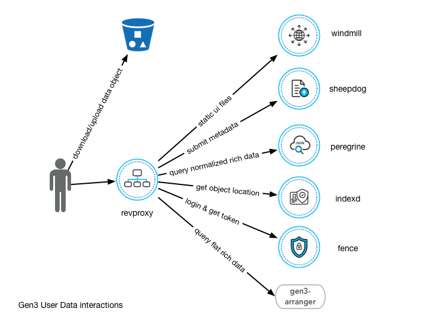
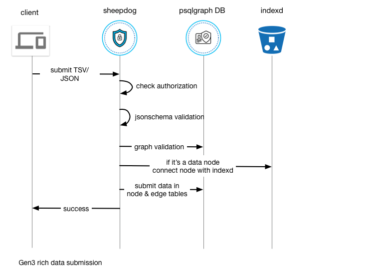
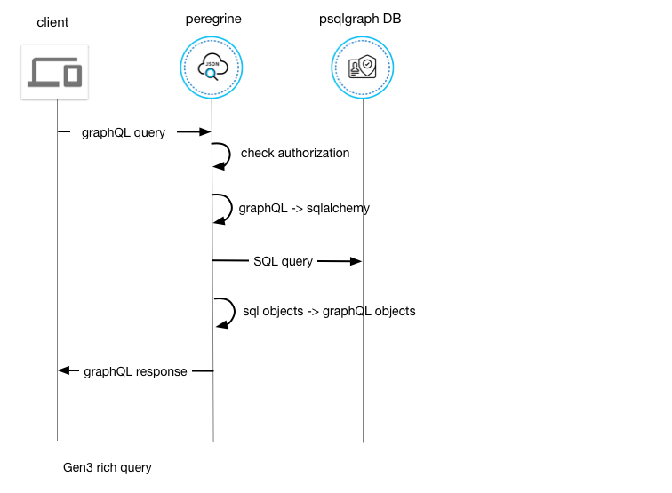
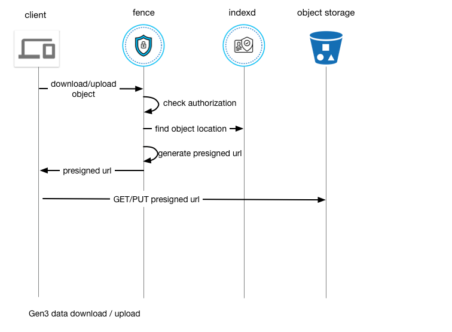
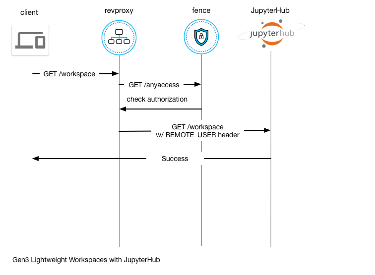

# Gen3 Technical Documentation
This documentation is intended for developers who want to understand the design and architecture of Gen3.

The Gen3 platform is a set of services that enables users to use data and compute resources easily from various cloud providers. It also provides a user-friendly environment to organize and query data, and run computational analysis.

## Terminology
### Data Object
Files on disk that are typically analyzed as a whole or in chunks. They are typically petabyte scale in data commons and sit in object storage.

### Rich Data
Data that are harmonized, indexed in various databases, discoverable and queryable.

## Data management

The following diagram describes all the user interactions in data management aspect.

1. Fence microservice provides authentication and authorization framework for all Gen3 services & resources.
2. Download/upload data. While Gen3 doesn't have services sitting between the user and cloud storage services so the user can fully leverage the cloud provider's power, it does provide tools and services to enable users to access protected data with temporary credentials.
3. Windmill serves static html, javascript and image files to create a view for users to interact with Gen3 microservices.
4. Sheepdog microservice allows user to do rich data submission.
5. Peregrine microservice allows user to do GraphQL queries on live rich data.
6. Indexd microservice allows user to find physical location for data object.
7. Gen3-arranger exposes GraphQL query interface for a flattened/materialized view of rich data that's ETLed from graph rich data to Elasticsearch.

### Data Submission System
A lot of data are generated during experiments and studies, and ideally are organized and annotated in a way that describes its context. All the 'context' is preserved in our 'rich data' database. The rich data store is presented in a graph-like relational model to depict the normalized relationships of all the concepts. Take the [BloodPAC](https://www.bloodpac.org/data-group/) data model as an example. It describes a study conducted on many `cases` (aka patients), how doctors gathered clinical information about each patient stored in nodes such as `diagnosis` and `family history`, and how the hospital gathered samples from the patient and sent them to sequencing centers which produced sequencing files store in `submitted unaligned reads`.

In order for a Gen3 Commons to preserve this rich data, a consistent data model with standard terminologies needs to be constructed. Our data model uses jsonschema, and stores the models as yaml fields in [GitHub](https://github.com/occ-data/bpadictionary) to make it easier for domain experts to make changes and track activity. The schema is then translated to database ORM([psqlgraph](https://github.com/NCI-GDC/psqlgraph)) and used by Gen3 microservices to do data validation and database interactions.

Our backend currently uses Postgres. This is not necessarily the optimal choice for complicated graph traversals, but we chose this database due to its robustness as a traditional relational database. The data model that is described in jsonschema is translated to a relational data model in Postgres, where every node and edge is a table. All properties are stored as jsonb in Postgres as opposed to separate columns. While this sacrifices some query performance, it supports frequent data modeling changes that are required by domain experts.

Sheepdog uses the dictionary-driven ORM to do metadata validation and submission as described in the following diagram:
.

Peregrine exposes a query interface for the normalized rich data via GraphQL interface:
.

Separately, users use [gen3-client](https://github.com/uc-cdis/cdis-data-client) to request temporary urls to do raw data download/upload:
.

### Data Denormalization System
_This is an alpha feature_

After we collect valuable data from various submitters, we would like to expose it in a user-friendly web interface. Understanding the datamodel and knowing how to traverse the graph is intimidating for a general Gen3 user, so we created an ETL application - [tube](https://github.com/uc-cdis/tube) to denormalize the graph to several types of flat documents to cater to several major use cases.

Tube is driven by configuration files which describe the flat document structure and the mapping logic from the graph model, so that it's generic and can support various datamodels in different commons. For most of the biomedical commons, there are two types of flat documents that satisfy the majority of users:
- A file-centric document that denormalizes biospecimen and clinical attributes for each file. This targets bioinformaticians who want to filter by specific clinical/biospecimen attributes and select files on which to run analysis.
- A case-centric document that denormalizes biospecimen and clinical attributes for each case. This targets clinicians who want to see distributions based on clinical attributes among cases. Most of the time, these cases represent patients.

[living document for data exploration architecture](https://github.com/uc-cdis/cdis-wiki/tree/master/dev/gen3/data_explorer)

## Workspace Systems

Workspaces are the compute component of a data commons. Workspaces allow users to execute analysis tasks on data without moving the data to another remote environment. Workspaces come in many forms, currently Gen3 integrates what it calls lightweight workspaces. Lightweight workspaces are designed to allow for quick analysis of data, and the creation of workflow jobs in the workflow system.

### Lightweight Workspaces

JuypterHub is a service which allows for multiple Jupyter notebooks to be run by multiple users on a central server. The isolation of the user notebooks depends on the spawner used, and in this case relies on the isolation provided between Kubernetes pods. The Gen3 JuypterHub service is based on [Zero to JuypterHub](https://github.com/jupyterhub/zero-to-jupyterhub-k8s) and [Kubeflow](https://github.com/kubeflow).

The following diagram shows the authorization flow for the JupyterHub instances. We utilize the Revproxy and Fence acting as an API gateway for these workspaces. JupyterHub is configured with the [remote user auth plugin](https://github.com/occ-data/jhub_remote_user_authenticator) so that users are authed based on the `REMOTE_USER` header.

JupyterHub runs in a container with an HTTP proxy. The proxy has dynamic routing that routes either to the hub or to the user's spawned jupyter notebook container.

JupyterHub is deployed into the default namespace for the commons, but user pods are deployed into the specific `jupyter-pods` namespace to provide an added layer of isolation. This is accomplished using the [Kubespawner](https://github.com/jupyterhub/kubespawner) plugin for JupyterHub. Eventually, users will be deployed into their own Kubernetes namespace so that they can utilize the K8s API to spin up clusters for Spark or Dask. We are tracking issues related to the creation and monitoring of multiple namespaces in Kubespawner [1](https://github.com/jupyterhub/kubespawner/pull/218) [2](https://github.com/jupyterhub/kubespawner/issues/76). We use a [customized JupyterHub](https://github.com/occ-data/containers/tree/master/jupyterhub) which contains additional code to cull idle notebooks after several hours of inactivity. This automatically scales down the cluster again when the notebooks are no longer in use by users.

Notebook servers are configured with persistent storage mounted into `/home/jovyan/pd` for users to store scripts and configurations which they wish to persist past notebook shutdown. In the future we would like to change this to have the storage for the user in the notebook backed by the cloud object storage (S3 or GCS) to improve scalability and the ability to load data into the containers for users.

Currently, we support user selectable notebook containers and resource allocations from a prepopulated list. [Earth science](https://github.com/occ-data/containers/tree/master/jupyter-geo) and [Bioinformatics](https://github.com/occ-data/containers/tree/master/jupyter) notebooks are available with popular libraries preconfigured. 

We also configure a [prepuller daemonset](https://github.com/uc-cdis/cloud-automation/blob/master/kube/services/jupyterhub/jupyterhub-prepuller.yaml) on K8s to pull the docker images for common user notebooks to each node in the cluster. This significantly speeds up launch time as these images can be many GB in size. 

### Full Workspaces

Full workspaces, i.e. workflow systems that run analysis pipelines at scale over data, are still to be implemented into Gen3. 
