# Running a Gen3 Data Commons

## 1. Compose Services


[Gen3 Compose Services](https://github.com/uc-cdis/compose-services) allow you to quickly run a Gen3 commons on a single computer or in a single VM in a matter of minutes using Docker Compose.

This option is suitable for those that wish to run a small data commons, experiment with the technology, or even do local development on the Gen3 services.

We recommend you start here for your first experience running the Gen3 platform. Using Compose Services will not make the full suite of automation and logging for Gen3 data commons available. If you intend to create a bigger data commons or deploy a data commons in a production environment, we strongly recommend you use [Cloud Automation](#2-cloud-automation).

[Explore Gen3 Compose Services here.](https://github.com/uc-cdis/compose-services)


## 2. Cloud Automation


[Gen3 Cloud Automation](https://github.com/uc-cdis/cloud-automation/blob/master/doc/csoc-free-commons-steps.md) is how we deploy Gen3 data commons in production environments on Amazon Web Services, Google Cloud Platform, Microsoft Azure, and OpenStack environments. Cloud Automation is fully featured supporting integrated logging, security, and compliance steps. With cloud Automation, we utilize Kubernetes to orchestrate our services into a scalable environment that can be run in a cost efficient manner for many tens to thousands of users.

Cloud automation utilizes Terraform for repeatable infrastructure deployments onto the public clouds. Additionally, we have custom Gen3 specific tooling to help automate various steps in the Kubernetes deployment process such as rolling pod versions, and scaling up.

We welcome all comments, feature requests, and pull requests using GitHub issues or the [Gen3 community](https://forums.gen3.org).

[Explore Gen3 Cloud Automation here.](https://github.com/uc-cdis/cloud-automation/blob/master/doc/csoc-free-commons-steps.md)


## 3. Creating a New Data Dictionary

### Core Dictionary
We have created a basic data dictionary [DCF data dictionary](https://github.com/uc-cdis/dcfdictionary) to get you started.  You can use the DCF Data Dictionary as a starting point for creating your own data dictionary in your own commons. It is a consensus of previously used data dictionaries and will make creating your own data dictionary more efficient. The basic structure of this and all dictionaries includes the following node categories:
### Node Categories
#### Administrative
The Project, Study, and Subject nodes are administrative nodes that are required for any Gen3 data commons. Administrative nodes store basic project and study information for their associated cases or subjects.  Also, the Subject node level is where the nodes start differentiating between commons.  It can also be represented as Case depending on the use case.

#### Clinical
The Subject node links to the Demographic and Diagnosis clinical nodes. These nodes are Clinical nodes that are used to store clinical and medical history related data. The Demographic node stores properties that represent the statistical characterization of human populations or segments of human populations (for example, characterization by year of birth, sex, and race). This node is typically used to store properties that do not change over time. The Diagnosis clinical node represents the investigation, analysis, and recognition of the presence and nature of disease, condition, or injury from expressed signs and symptoms. It also pertains to the scientific determination of any kind and the concise results of such an investigation.

#### Biospecimen
The Biospecimen node category is associated with data related to biological specimens as it relates to testing, diagnostic, propagation, treatment or research purposes.  This node can contain one or more components including but not limited to cellular molecules, cells, tissues, organs, body fluids, embryos, and body excretory products.  It is composed of nodes such as Sample, Aliquot, and Read Group.  For example, in some commons Sample can represent an actual piece of tissue removed from a biological entity for testing, diagnostic, propagation, treatment or research purposes and an aliquot represents a nucleic acid extraction from this tissue.  The number of biospecimen nodes can be tuned for a particular commons depending on the desired level of granularity required.  Read group refers to sequencing read group and can be important for commons that require bioinformatics processing of sequencing data.

#### Analysis
The Analysis node category stores data that is associated with genomic pipeline analysis that is typical of next generation sequencing (NGS).  Example Analysis nodes include Genotyping Array Workflow which stores metadata for genotyping array workflow, the Proteomic Workflow node  which stores metadata for the protein mass spectrometry workflow, and the Aligned Workflow node which stores metadata for alignment pipeline used to align reads.

#### Data File
The Data File node category is used to store metadata related to data files that are stored in the cloud. It contains nodes such as Submitted Aligned Reads, Submitted Unaligned Reads, and Aligned Reads.  These nodes contains properties such as file_name, file_size, and data_format which describe information stored in the file.

#### Index File
The Index File node category stores the metadata that is associated with different file formats (for example, BAI and BAM).  For example, the Aligned Reads Index node contains the index for a set of aligned reads.

#### Notation
The Notation node category is used to store data that does not fit into other categories (for example, it doesn't store index files, data files, or analysis data).  The ability to update/modify a dictionary is an important functionality that may arise based on project and clinical data needs.

The following image depicts the graph view of the DCF data dictionary (The key in the top right corner of the image indicates the node categories):

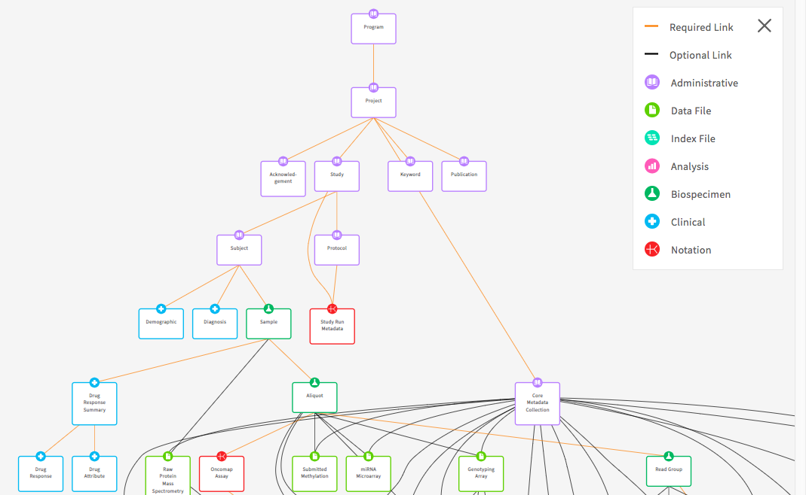

### Representing Longitudinal Data
Gen3 doesn't allow the reporting of actual dates. As a result, the concept of date intervals can be used in its place. Properties such as days_to_birth, days_to_death, days_to_last_follow_up, and days_to_treatment provide a means to keep track of timing between visits while protecting study participant identities. These properties begin with the same date, which is called the index date. The index date is day 0 and any event that occurs before that date is a negative number and any event that occurs after that date is a positive number. For example, if days_to_birth is -12784 and the index date is diagnosis. This means that the participant was born 12,784 days prior to the diagnosis given the negative number. It also infers that the patient was 35 at diagnosis.

Gen3 provides the ability to store longitudinal data. A clinical node that is not included in the DCF is the Visit or Follow-Up node. The Visit node is a clinical node that is used to store longitudinal data that is collected over time and usually has a many to one relationship with its parent node, meaning that an observation/response was observed for a subject/unit repeatedly over time. Clinical properties that are common for this node include height, weight, and bmi (body mass index). If the need arises, the node can be added to a data dictionary.

### Modifying a Data Dictionary
Once users have obtained the baseline dictionary, users can make updates to it.  To create a data dictionary tailored to a particular project, the user can modify the baseline dictionary using a program which automatically updates the dictionary given TSV input which specifies the desired changes to the dictionary. The updates are based on instructions that are included in a TSV file such as update a property, delete a node, etc.  Instructions for implementing the script can be found [here](https://github.com/uc-cdis/planx-bioinfo-tools/tree/master/dictionary_tools). For those that are interested in making edits directly to a YAML file, we are also in the process of automating this process.

> Note: The Gen3 dictionary is stored in JSON format following the [jsonschema](https://cswr.github.io/JsonSchema/spec/basic_types/). The backend (Sheepdog) stores properties in the database as jsonb.

#### Referencing external data standards
Gen3 is expanding the information in data dictionaries by including references to controlled vocabularies such as the National Cancer Institute Thesaurus (NCIt).  This will help with the comparison of studies and projects across data commons and provide researchers with proper references.  The NCIt is being used for many of the schemas as it's inclusive of several different domains (for example, clinical, drug, etc.).  It also has an abundance of non-domain related terms such as nominal (for example, gender, race) and ordinal (for example, left, right, first, last) along with other useful categories of terms.  The benefit of this effort is that it will facilitate cross data commons comparison.  For instance, if tuberculosis is a term associated with multiple studies, a search of that term will provide insight into each of the studies.  It will also help with the prevention of adding multiple terms for properties that mean the same thing.  The example below demonstrates a cross study comparison using YAML files (Gen3 uses YAML files to help organize data dictionaries.  The files are used by internal systems to help manage the data dictionaries.)  The two files both relate to blood pressure finding, but each has a different term name.  The external reference helps with harmonization efforts by helping identify terms that have the same meaning.

```
Dictionary 1:
Blood Pressure Measurement:
    description: Measurement of blood pressure
    enum:
      - 90 over 60 (90/60) or less
      - More than 90 over 60 (90/60) and less than 120 over 80 (120/80)
      - More than 120 over 80 and less than 140 over 90 (120/80-140/90)
      - 140 over 90 (140/90) or higher (over a number of weeks
    termDef:
       - term: Blood Pressure Finding
         source: NCI Thesaurus
         term_id: C54707
         term_version: 18.10e (Release date:2018-10-29)
         term_url: "https://ncit.nci.nih.gov/ncitbrowser/ConceptReport.jsp?dictionary=NCI_Thesaurus&ns=ncit&code= C54707"
Dictionary 2:
Blood Pressure Reading:
    description: An indication of blood pressure level
    enum:
      - low blood pressure
      - normal
      - pre hypertension
      - hypertension
    termDef:
       - term: Blood Pressure Finding
         source: NCI Thesaurus
         term_id: C54707
         term_version: 18.10e (Release date:2018-10-29)
         term_url: "https://ncit.nci.nih.gov/ncitbrowser/ConceptReport.jsp?dictionary=NCI_Thesaurus&ns=ncit&code= C54707"
```
### Best Practices

#### Data Normalization
When adding a new project or study into a new or an already existing data dictionary, it's important to follow the process of harmonization of data.  The harmonization process centers around updates or additions to the data dictionary, along with the possible need to harmonize the data. This process helps with the prevention of redundant properties, nodes, and allowable values that may already exist in a data dictionary.  It also involves the possibility of a data migration if the data dictionary changes affect the preexisting data (For example, the height property unit of measure change from meters to centimeters).  Before submitting new data to a commons or submitting updates to a data dictionary, check the current dictionary for properties, nodes, or enumerated values that already exist.  If there is a similar property, node, or enumerated value that exists, it's best practice to use the existing node, property, or enumerated value.  For example, if a candidate property named “infection agent” and a property named “infectious agent” already exist, then use “infectious agent.”

#### Specificity vs. Generality

One of the goals when providing an external reference is to figure out the level of specificity when breaking down a property name that contains multiple concepts.  The question is whether the new references should be created with very specific designations (This is known as pre-coordination).   This option would likely create the need for the request of new terms in the external standard if the term is not in existence. The other question is, should the use of multiple terms that already exist in an external standard be used (This is known as post-coordination)?  The best practice adopted by Gen3 is to use specificity whenever corresponding terms are available in the external standard.  However, If specific terms are not available, lean towards generality by creating multiple terms that already exist in an external standard.  For instance, if grapefruit juice is a property of interest and it's not found in the external reference, but grapefruit and juice are found individually, then using the individual properties is the preferred method.

#### Creating Valuable Data Descriptions

It's important to create clear and concise descriptions for each property in a dictionary. The descriptions should be understandable by someone who is not familiar with a particular domain. When available, including the unit of measure in parenthesis at the end of the description would be helpful in cases where the unit of measure is not included elsewhere in the description. When a clear description is not readily available, it's recommended that an external vocabulary such as NCIt be used as they offer definitions for terms from a plethora of domains.

#### Selecting the Property Type

The Gen3 model allows for a selection of property types that can be used to specify or limit values submitted for each property.
The available types are [jsonschema types](https://cswr.github.io/JsonSchema/spec/introduction/) such as:
- string; [example](https://github.com/uc-cdis/openaccess_dictionary/blob/415bf61707ba55a6772423c461da3f16eef9c451/gdcdictionary/schemas/drug.yaml#L274)
- boolean; [example](https://github.com/uc-cdis/openaccess_dictionary/blob/415bf61707ba55a6772423c461da3f16eef9c451/gdcdictionary/schemas/drug.yaml#L79)
- number; [example](https://github.com/uc-cdis/openaccess_dictionary/blob/415bf61707ba55a6772423c461da3f16eef9c451/gdcdictionary/schemas/drug.yaml#L354); can be float, long, or double as shown [here](https://json-schema.org/understanding-json-schema/reference/numeric.html).
- integer; [example](https://github.com/uc-cdis/openaccess_dictionary/blob/415bf61707ba55a6772423c461da3f16eef9c451/gdcdictionary/schemas/drug.yaml#L418)
- enum; [example](https://github.com/uc-cdis/openaccess_dictionary/blob/415bf61707ba55a6772423c461da3f16eef9c451/gdcdictionary/schemas/drug.yaml#L401)
- array; [example](https://github.com/uc-cdis/openaccess_dictionary/blob/415bf61707ba55a6772423c461da3f16eef9c451/gdcdictionary/schemas/expression_result.yaml#L150)
- regex patterns (including strings, integers, and numbers to modify the format); [example](https://github.com/uc-cdis/openaccess_dictionary/blob/415bf61707ba55a6772423c461da3f16eef9c451/gdcdictionary/schemas/_definitions.yaml#L103)
- null; [example](https://github.com/uc-cdis/openaccess_dictionary/blob/415bf61707ba55a6772423c461da3f16eef9c451/gdcdictionary/schemas/_definitions.yaml#L80)
- object; [example](https://github.com/uc-cdis/openaccess_dictionary/blob/415bf61707ba55a6772423c461da3f16eef9c451/gdcdictionary/schemas/_definitions.yaml#L47)

#### Avoiding Data Loops

When creating a data model it's important to avoid loops or cycles between nodes.  A cycle is created when a relationship between nodes is created on top of an already existing chain of relationships.  In other words, loops occur when one relationship is completely derivable from combined relationships that already exist.  Loops have a negative effects on down stream functions and tools such as ETL mappings and elastic search.

The following diagram is an example of a loop as R3 is redundant as it brings no new associations that are not already presented by the combination of R1 and R2:

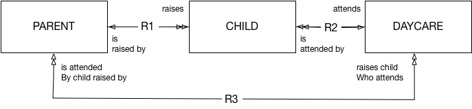

## 4. Dictionary Update Documentation

When making updates to data dictionaries, it's important to document these changes for good record keeping purposes.  The documentation should be implemented in the release notes of the respective GitHub site.  All changes should be denoted from minor to major changes.  Common updates include enumerated value modifications, adding or removing properties or nodes, and updates to links that describe relationships and dependencies between nodes.  Every release is associated with a unique tag which differentiates dictionary versions.  The tags are incrementally changed based on how extensive an update (for example, for a minor update such as changing a property name version 3.3.2 would become 3.3.3).

### Example Documentation

      Gen3 Product: Sample Data Hub
      Release Date: May 30, 2019
      New Features and Changes

      Create the following node:
      sample

      Add the following properties to the sample node:
      sample_name
      sample_time

      Remove the following properties from the demographic node:
      sex
      height

      Add new link:
      sample to visit node

Proper documentation of dictionary updates fosters accountability and creates a historical representation of all dictionary changes that will allow future operators of the dictionary to understand how the dictionary has evolved over time.

When generating the release notes there are [conventions](https://github-tools.github.io/github-release-notes/concept.html) that have been established that help with transparency and readability of release notes.  The conventions include:

  1) Start the subject line with a verb (for example, Update to enumerated value)
  2) Use the imperative mood in the subject line (for example, Add, not Added or Adds header styles)
  3) Limit the subject line to about 50 characters
  4) Do not end the subject line with a period
  5) Separate subject from body with a blank line
  6) Wrap the body at 72 characters
  7) Use the body to explain what and why, not how

## 5. Authentication Methods

The following methods of authentication are supported in Gen3. They are listed in order of preference from OCC perspective, and technological and governance considerations are outlined below.

### eRA Commons

Authentication system developed by NIH for the management of research grants.

_Pros_

* Intended for officials, principal investigators, trainees and post-docs at institutions/organizations to access and share information relating to research grants.

_Cons_

* Can only be used if sponsored by an NIH institute.

### Google (organizational account)

Google Sign-In secure authentication system as provided by the user’s organization.

_Pros_

* User’s organization inherently takes responsibility for actions taken by user under the auspice of their organizational identity.
* User’s organization takes responsibility for activating/deactivating and monitoring identity.

_Cons_

* Can only be used if the user’s organization utilizes Google for identity management.

### Microsoft Office 365 (organizational account)

Microsoft Office 365 secure authentication system as provided by the user’s organization.

_Pros_

* User’s organization inherently takes responsibility for actions taken by user under the auspice of their organizational identity.
* User’s organization takes responsibility for activating/deactivating and monitoring identity.

_Cons_

* Can only be used if the user’s organization utilizes Microsoft Office 365 for identity management.

### InCommon

InCommon, operated by Internet2, provides a secure and privacy-preserving trust fabric for research and higher education, and their partners, in the United States. Individual identity providers, such as NIH iTrust and most academic institutions, are federated by InCommon.

_Pros_

* User’s organization inherently takes responsibility for actions taken by user under the auspice of their organizational identity.
* User’s organization takes responsibility for activating/deactivating and monitoring identity.

_Cons_

* Can only be used if the user’s organization is part of the InCommon federation.
* Reference [this resource](https://www.opensciencedatacloud.org/console/) for organizations supported by InCommon.

### eduGAIN

eduGAIN is an international “interfederation” of identity and service providers around the world. InCommon is a participant in eduGAIN.

_Pros_

* User’s organization inherently takes responsibility for actions taken by user under the auspice of their organizational identity.
* User’s organization takes responsibility for activating/deactivating and monitoring identity.
* International presence, and InCommon is a participant

_Cons_

* Can only be used if the user’s organization is part of one of the 60+ federations participating in eduGAIN.
* Reference [this resource](https://edugain.org/participants/how-to-use-edugain/) for organizations supported by eduGAIN.

### ORCID

Provides an identifier for individuals to use with their name as they engage in research, scholarship, and innovation activities.

_Pros_

* Most (all) researchers either have an ORCID or can easily create an ORCID.

_Cons_

* User’s organization does not inherently take responsibility for actions taken by user under auspice of ORCID identity.
* Neither user’s organization nor ORCID take responsibility for activating/deactivating users based on affiliation.

### Google / Microsoft Office 365 (personal account)

Google Sign-In / Microsoft Office 365 secure authentication systems as registered by an individual with no organizational affiliation or management.

_Pros_

* Most users either have a Google/Microsoft identity or can easily create one.

_Cons_

* User’s organization does not inherently take responsibility for actions taken by user under auspice of personal Google/Microsoft identify.
* Neither user’s organization does not take responsibility for activating/deactivating users based on affiliation.


## 6. Programs and Projects
In a Gen3 Data Commons, programs and projects are two administrative nodes in the graph database that serve as the most upstream nodes. A program must be created first, followed by a project. Any subsequent data submission and data access, along with control of access to data, is done through the project scope.

Before you create a program and a project or submit any data, you need to grant yourself permissions. First, you will need to grant yourself access to **create** a program and second, you need to grant yourself access to *see* the program. You can **create** the program before or after having access to *see* it.
For this, you will need to edit the `Secrets/user.yaml` file following the docs shown [here](https://github.com/uc-cdis/fence/blob/master/docs/user.yaml_guide.md#programs-and-projects-crud-access).

Make sure to update user privileges:
```
docker exec -it fence-service fence-create sync --arborist http://arborist-service --yaml user.yaml
```

To create a program, visit the URL where your Gen3 Commons is hosted and append `/_root`. If you are running the Docker Compose setup locally, then this will be `localhost/_root`. Otherwise, this will be whatever you set the `hostname` field to in the creds files for the services with `/_root` added to the end. Here, you can choose to either use form submission or upload a file.  I will go through the process of using form submission here, as it will show you what your file would need to look like if you were using file upload. Choose form submission, search for "program" in the drop-down list and then fill in the "dbgap_accession_number" and "name" fields. As an example, you can use "123" as "dbgap accession number" and "Program1" as "name". Click 'Upload submission json from form' and then 'Submit'. If the message is green ("succeeded:200"), that indicates success, while a grey message indicates failure. More details can be viewed by clicking on the "DETAILS" button. If you don't see the green message, you can control the sheepdog logs for possible errors and check the Sheepdog database (`/datadictionary`), where programs and projects are stored. If you see your program in the data dictionary, neglect the fact that at this time the green message does not appear and continue to create a project.

To create a project, visit the URL where your Gen3 Commons is hosted and append the name of the program you want to create the project under. For example, if you are running the Docker Compose setup locally and would like to create a project under the program "Program1", the URL you will visit will be `localhost/Program1`. You will see the same options to use form submission or upload a file. This time, search for "project" in the drop-down list and then fill in the fields. As an example, you can use "P1" as "code", "phs1" as "dbgap_accession_number", and "project1" as "name". If you use different entries, make a note of the dbgap_accession_number for later. Click 'Upload submission json from form' and then 'Submit'. Again, a green message indicates success while a grey message indicates failure, and more details can be viewed by clicking on the "DETAILS" button. You can control in the `/datadictionary` whether the program and project have been correctly stored.

After that, you're ready to start submitting data for that project! Please note that Data Submission refers to metadata regarding the file(s) (Image, Sequencing files, etc.) that are to be uploaded. Please refer to the [Gen3 website](https://gen3.org/resources/user/submit-data/) for additional details.


## 7. How to Upload and Control File Access via authz
This section guides you through how to set up a granular access to data files by editing programs/projects. Note, that this does not apply to graph metadata.

**a) Upload data files**

1. [Download the gen3-client](https://github.com/uc-cdis/cdis-data-client/releases)
2. [Configure the gen3-client to your commons](https://gen3.org/resources/user/gen3-client/#2-configure-a-profile-with-credentials)
3. [Upload the multiple files to your commons](https://gen3.org/resources/user/gen3-client/#3-upload-data-files)
4. [Create a Core Metadata Collection node entry](https://gen3.org/resources/user/submit-data/#1-prepare-project-in-submission-portal)
5. [Map files to the project](https://gen3.org/resources/user/submit-data/#3-map-uploaded-files-to-a-data-file-node)
6. Download the tsv file for the reference_file node:
   - [Go to the project page by clicking on the `submit data` button for the project](https://gen3.org/resources/user/submit-data/#begin-metadata-tsv-submissions)
   - [Click on the reference_file node in the graph model to bring up the node page](https://gen3.org/resources/user/submit-data/#learning-more-about-the-existing-submission)
   - Download the entire node via the `Download All` button, selecting the tsv option.
7. Obtain the GUIDs from the downloaded reference file node. The GUIDs are found under the `object_id` column and there will be one for each data file entry in the graph model.

**b) Update the “authz” field using the Gen3 Python SDK**

1. Download the Gen3 Python SDK [here](https://github.com/uc-cdis/gen3sdk-python), as this will allow you to make changes to the indexd records. Run `pip install gen3`.
2. Programatically change the authz of the indexd record:
   - With the list of GUIDs for a specific institution and your credentials that you downloaded from the profile page on the commons, you will run the following Python script that will make edits to the indexd database. In this example Python script, the changes to the authz field are being made to the program and project `my_program-TEST1`. In this instance, the new authz field is going to have a `sources` resource called `DEMO`. The endpoint is the common’s url and the auth function will call your credentials files.

    ```
      import gen3
      from gen3.auth import Gen3Auth
      from gen3.index import Gen3Index

      guids=["guid1",”guid2”,”guid3”...”guidN”]

      new_authz="/programs/my_program/projects/TEST1/sources/DEMO"


      endpoint="https://url.commons.org" #commons URL
      auth=Gen3Auth(endpoint, refresh_file="credentials.json") #your creds

      index = Gen3Index(endpoint,auth)

      for guid in guids:
          index.update_record(guid=guid, authz=[new_authz])
          print(guid + " has been updated to the following authz: " + new_authz)

    ```
3. Make connections in the reference_file node to attach the reference_file entries to the projects.code:
    - The files at this time are only connected to the `core_metadata_collection` node, and they will need to be linked to the rest of the graph model. In the tsv, populate the `projects.code` column with the projects.code value, in this example, it would be `TEST1`. Save this tsv and re-upload the file into the project. [See here for more info.](https://gen3.org/resources/user/submit-data/#begin-metadata-tsv-submissions)


**c) Edit the user.yaml**

The user.yaml will require changes to three sections to make these files with new authz fields accessible:

1. Policies. This notes the resource path and the permissions (role_id) you will give to the id.
```
- id: 'my_program-TEST_DEMO_downloader'
role_ids:
- 'reader'
- 'storage_reader'
resource_paths:
- '/programs/my_program/projects/TEST1/sources/DEMO
```

2. Resources. The list structure of the resources as seen in your resource path, for example `/programs/my_program/projects/TEST1/sources/DEMO`:
```
resources:
- name: my_program
  subresources:
     - name: projects
    	subresources:
    	- name: TEST1
      	  subresources:
      	  - name: sources
           subresources:
           - name: name1
           - name: DEMO
           - name: name2
           - name: name3
           - name: name4
```

3. Users. The user profile and the id that is assigned to them, which allows for the permissions set in the policies:
```
  user@gmail.edu:
	policies:
	- my_program-TEST1_reader
	- my_program-TEST1_name1_downloader
	- my_program-TEST1_DEMO_downloader
	- my_program-TEST1_name2_downloader
	- my_program-TEST1_name3_downloader
	- my_program-TEST1_name4_downloader
```

## 8. ETL and Data Explorer Configurations

ETL stands for “extract, transform, load”. In Gen3, it refers to the process of moving data from the PostgreSQL database (graph model) to the ElasticSearch database (flat model), which is carried out by the Gen3 Service [Tube](https://github.com/uc-cdis/tube).

Newly ingested data to the [Sheepdog Service](https://github.com/uc-cdis/sheepdog) can be queried immediately via [Peregrine](https://github.com/uc-cdis/peregrine), but not on the Data Explorer, which is powered by [Guppy](https://github.com/uc-cdis/guppy) on the backend.  During the ETL process, Tube will populate ElasticSearch indices and Guppy makes the ElasticSearch indices available for queries for the Data Explorer.

In practice, Guppy/Tube need to be configured with the ElasticSearch indices in the manifest.json (versions in the [versions block](https://github.com/uc-cdis/cdis-manifest/blob/6bc0dc84bec2af7d7971d2a4342319b225728969/gen3.datacommons.io/manifest.json#L23) and indices in the [guppy block](https://github.com/uc-cdis/guppy#configurations)) and the [etlMapping.yaml file](https://github.com/uc-cdis/tube/blob/master/docs/configuration_file.md) has to be configured to list those indices. Additionally, `aws-es-proxy` needs to be included in the versions block of the [manifest.json](https://github.com/uc-cdis/cdis-manifest/blob/ad85ef9a74d07fadf28c7d176c8aaa5efae4ecab/gen3.datacommons.io/manifest.json#L11), unless a customized endpoint to access ElasticSearch can be provided.
Note that configuring the etlMapping.yaml is dependent on what users want to display on the Explorer page and needs to match to the Data Dictionary. The etlMapping.yaml can be validated against the Data Dictionary as described [here](https://github.com/uc-cdis/gen3utils#etlmappingyaml-validation).
After configuring etlMapping.yaml, indices need to be created, cleaned, or/and re-populated using the `gen3 gitops configmaps` command to read the new etlMapping.yaml, and the `gen3 job run etl` command to run the ETL. Note, that new indices need to be added to both files etlMapping.yaml and manifest.json.

In the next step, the [gitops.json](https://github.com/uc-cdis/data-portal/blob/master/docs/portal_config.md) needs to be configured to display and populate the indices of interest in the Data Explorer. Remember that only the properties occurring in the etlMapping.yaml can be brought into the gitops.json. The gitops.json can be [tested locally](https://github.com/uc-cdis/data-portal#local-development-and-devhtml) and [validated against the Data Dictionary and etlMapping.yaml file](https://github.com/uc-cdis/gen3utils#portal-configuration-gitopsjson-validation). Finally, after new indices are introduced, Guppy needs to be rolled using the command `gen3 roll guppy`. A comprehensive list of commands is given [here](https://github.com/uc-cdis/cloud-automation/blob/master/doc/README.md).

## 9. Gen3 Portal Configurations Examples

Below we show a few examples of how to customize the Gen3 Data Portal.

For more technical background, see [portal configurations on GitHub](https://github.com/uc-cdis/data-portal/blob/master/docs/portal_config.md).

### Login Page - Helix Image

Customize the image that appears on the [Login Page](https://gen3.datacommons.io/login) with a vector graphic (eg. *.svg) of your choice.

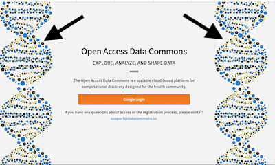

- [Review the code to save the image](https://github.com/uc-cdis/cdis-manifest/blob/456e1a3b5b3cc5dc23b83e1f96c0770a2007162a/gen3.datacommons.io/portal/gitops-sponsors/gene_bgy.svg).
- [Review code to include the path-to-image in gitops.json](https://github.com/uc-cdis/cdis-manifest/blob/456e1a3b5b3cc5dc23b83e1f96c0770a2007162a/gen3.datacommons.io/portal/gitops.json#L130).


### Login Page - Information on Login and Commons

Customize the text that appears on the [Login Page](https://gen3.datacommons.io/login) by specifying title, description, subtitle, contact, or email.

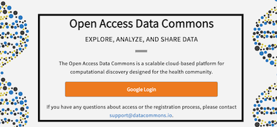

- [Review the code to edit title, subtitle, text, contact, and email](https://github.com/uc-cdis/cdis-manifest/blob/456e1a3b5b3cc5dc23b83e1f96c0770a2007162a/gen3.datacommons.io/portal/gitops.json#L124-L129).


### Landing Page Data Commons - Information on Commons

Customize the name of the Data Commons, the info text, and the button below that  appear on the top left side of the Landing Page after logging in.

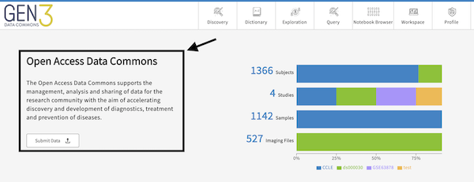

- [Review the code to edit heading, text, and link](https://github.com/uc-cdis/cdis-manifest/blob/456e1a3b5b3cc5dc23b83e1f96c0770a2007162a/gen3.datacommons.io/portal/gitops.json#L39-L44).


### Landing Page Data Commons - Summary Statistics

Customize the summary statistics that appear on the top right side of the Landing Page after logging in. The attributes are graphQL fields, which must be in the dictionary, configured in the etlMapping.yaml, and populated with data on the backend.

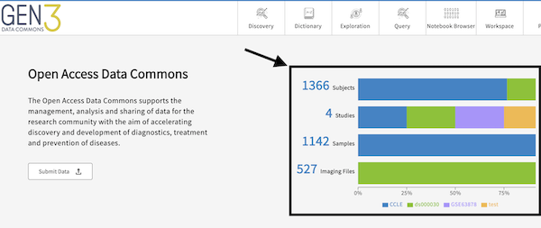

- [Review the code to edit graphQL queries](https://github.com/uc-cdis/cdis-manifest/blob/456e1a3b5b3cc5dc23b83e1f96c0770a2007162a/gen3.datacommons.io/portal/gitops.json#L3-L36).
- [Review the code to edit the graphQl queries after being logged in](https://github.com/uc-cdis/cdis-manifest/blob/4a922a04456423fea5d1e59c5431cedb460280d0/data.midrc.org/portal/gitops.json#L98-L113).


### Landing Page Data Commons - Cards

Customize the cards that appear on the bottom of the Landing Page after logging in.

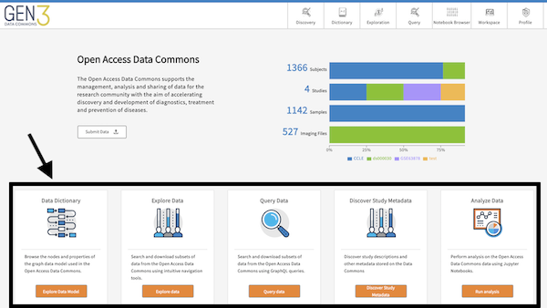

- [Review the code to edit name, icons, body, link, and label of the cards](https://github.com/uc-cdis/cdis-manifest/blob/456e1a3b5b3cc5dc23b83e1f96c0770a2007162a/gen3.datacommons.io/portal/gitops.json#L46-L75).
- Adding a new icon requires saving the icon in [this repository](https://github.com/uc-cdis/data-portal/tree/master/src/img/icons) and [in this file](https://github.com/uc-cdis/data-portal/blob/67f2b83227b9c3b48143bd2938cad160fc225394/src/img/icons/index.jsx).


### Data Commons Navigation Items

Customize the icons, link, and names that appear on the Data Commons navigation bar.
The "tooltip" shows text upon hovering over the icon.

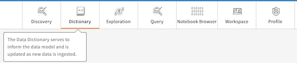

- [Review the code to edit icon, link, color, tooltip, and name of the navigation items](https://github.com/uc-cdis/cdis-manifest/blob/551f0963e60f6000ae8b9987592495406a031c81/gen3.datacommons.io/portal/gitops.json#L84-L134).
- Adding a new icon requires saving the icon in [this repository](https://github.com/uc-cdis/data-portal/tree/master/src/img/icons) and [in this file](https://github.com/uc-cdis/data-portal/blob/67f2b83227b9c3b48143bd2938cad160fc225394/src/img/icons/index.jsx).

### Data Commons Title

Customize the title that appears in the top left corner.

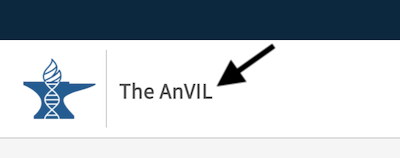

- [Review the code to edit the title of the Data Commons](https://github.com/uc-cdis/cdis-manifest/blob/a68f8df12173e4b9d06dcdf3fad2cc1643a73f89/gen3.theanvil.io/portal/gitops.json#L71-L72).


### Data Commons Top Bar

Customize the top bar that appears in the top right corner.

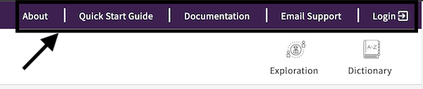

- [Review the code to edit the top bar (link, name, icon, dropdown) of the Data Commons](https://github.com/uc-cdis/cdis-manifest/blob/4a922a04456423fea5d1e59c5431cedb460280d0/data.midrc.org/portal/gitops.json#L146-L171).


### Data Commons Color Theme

Customize the color theme for buttons, top navigation bar, and any types of charts on the Exploration and Landing Page.

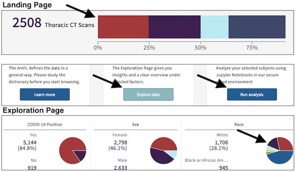

- [Review the code to edit the 9 colors of a Data Commons](https://github.com/uc-cdis/cdis-manifest/blob/4a922a04456423fea5d1e59c5431cedb460280d0/data.midrc.org/portal/gitops.json#L146-L171).


### Data Commons Footer Logo

Customize the logos in the Footer.

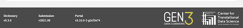

- [Review the code to edit the source, link, and name of logos in the footer of a Data Commons](https://github.com/uc-cdis/cdis-manifest/blob/551f0963e60f6000ae8b9987592495406a031c81/gen3.datacommons.io/portal/gitops.json#L156-L168).


### Data Commons Notebook Browser

Customize the [Notebook Browser](https://chicagoland.pandemicresponsecommons.org/resource-browser) page to preview Jupyter Notebooks by adding images, titles, descriptions, and links to the Jupyter Notebook.

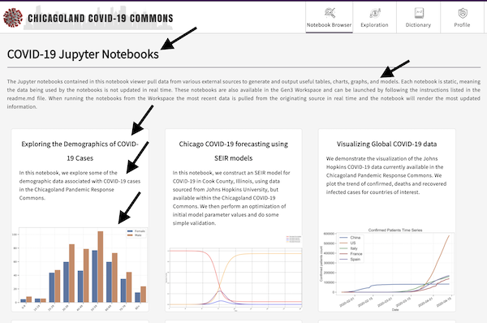

- [Review the code to edit the title (top; notebooks), description (top; notebooks), link, and imageURL (preview image)](https://github.com/uc-cdis/cdis-manifest/blob/0e5a08eed8b417a721a6324f820abe8ea4ef4e17/chicagoland.pandemicresponsecommons.org/portal/gitops.json#L1097-L1175).

### Data Commons Discovery Page

Customize and enable the [Discovery Page](https://gen3.datacommons.io/discovery) by editing the table items, advanced search fields, tags, and study page fields (i.e. page that opens up upon clicking on a study). The Discovery Page is powered by the [Metadata Service](https://github.com/uc-cdis/metadata-service) on the backend. Tools such as the [Python SDK](https://github.com/uc-cdis/gen3sdk-python/blob/master/gen3/cli/discovery.py) can be used to upload and edit metadata.

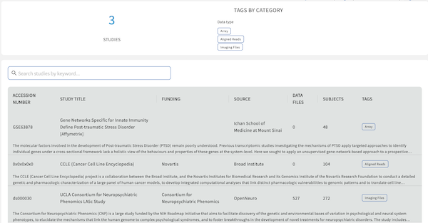

- [Review the code to enable the Discovery Page](https://github.com/uc-cdis/cdis-manifest/blob/551f0963e60f6000ae8b9987592495406a031c81/gen3.datacommons.io/portal/gitops.json#L173).
- [Review the code to edit the Discovery Page](https://github.com/uc-cdis/cdis-manifest/blob/551f0963e60f6000ae8b9987592495406a031c81/gen3.datacommons.io/portal/gitops.json#L175-L297).
