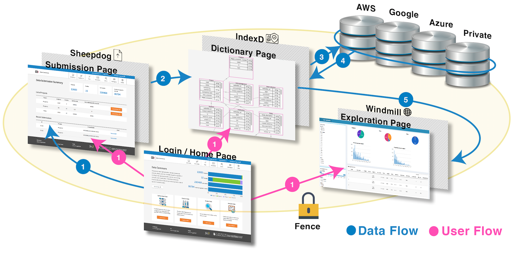

## Welcome to the General Gen3 Data Commons Documentation
* * *

<h3>Overview</h3>

The Center for Translational Data Science (CTDS) at the University of Chicago has developed and maintains [the Gen3 software stack](https://cdis.uchicago.edu/gen3/) to help accelerate scientific discovery through creation of a collaborative infrastructure that enables sharing of information between stakeholders in industry, academia, and regulatory agencies.

The Gen3 software stack is a [collection of microservices](https://cdis.uchicago.edu/gen3/) that enable the standing-up of data commons, which allows different partner organizations to pool data and grants approved researchers access to harmonized datasets in a scalable, reproducible, and secure manner.

<h3>Guiding Principles</h3>

* OPEN DATA

We believe that data must be open and accessible within the research community to collectively achieve the critical mass of data necessary to power data-driven research, insight, and discovery.

* OPEN-SOURCE

We believe that collaboration creates a knowledge pool that not only drives better software development, but also connects us to an active community in pursuit of shared social impact.  We have long benefitted from open-source software and are committed to contributing to future generations of software and scholars.

* OPEN INFRASTRUCTURE

We believe that rapid innovation is most effectively achieved through an open infrastructure environment where portability and compatibility are maximized and knowledge is distributed broadly.

For more information visit: [CTDS Guiding Principles](https://cdis.uchicago.edu/guiding-principles).

<h3>Support</h3>

Operation of the Gen3 commons is supported by generous grants from Amazon Web Services' [Grants for Research Credit Program](https://aws.amazon.com/research-credits/) and Microsoft Azure's [Research Grant Program](https://www.microsoft.com/en-us/research/academic-program/microsoft-azure-for-research/).

## The Data Commons Architecture
* * *

User access to the Gen3 data commons runs through a Virtual Private Cloud (VPC). Access to data and analysis tools through a VPC allows for balance of usability and security. All access is through a monitored head node. Data is not directly accessed from the Internet.

Other secure and compliant Gen3 member systems (including cloud-based systems) can access Gen3 data through the API.

<h3> Diagram of the System Architecture </h3>

## Online Resources
* * *

* [The Gen3 YouTube channel](https://www.youtube.com/channel/UCMCwQy4EDd1BaskzZgIOsNQ/videos)
* [The Gen3 Forum](https://forums.gen3.org/)
* [CTDS GitHub Organization](https://github.com/uc-cdis/)

## Contact CTDS Staff
* * *

* Locations:
	* [Shoreland](https://www.google.com/maps/place/Shoreland/@41.7962274,-87.5837128,17z/data=!3m1!4b1!4m5!3m4!1s0x880e297518655577:0x2fb20b44b0d04984!8m2!3d41.7962274!4d-87.5815188):
		5454 South Shore Drive
		Suite 2B
		Chicago, IL 60615
 
	* [University of Chicago](https://www.google.com/maps/place/Knapp+Center+for+Biomedical+Discovery+KCBD/@41.7916469,-87.6055968,17z/data=!3m1!4b1!4m5!3m4!1s0x880e293eb63accd1:0xb6f95ee97c4b5e08!8m2!3d41.7916469!4d-87.6034081):
		900 East 57th Street
		10th Floor, Room 10148
		Chicago, IL 60616
 

* Email:
	* General Inquiries: <ctds@uchicago.edu>.
	* Technical Support: <support@datacommons.io>.

* * *
