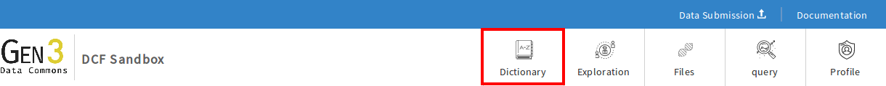

# Data Dictionary Viewer
* * *

* The Data Dictionary Viewer is designed to make it easier to understand the data model, the field types associated with each node, and the potential values associated with each field. It displays available fields in a node and the dependencies a given node has to the existence of a prior node.  This is an invaluable tool for both the submission of data and later analysis of the entire commons.   

* The Data Dictionary Viewer will also let the user toggle views and browse the nodes as a graph and as tables.  

* Gen3 members can use it through the 'Dictionary' icon at https://data.mycommons.org/dd.

> __NOTE:__ For these user guides, https://data.mycommons.org is an example URL and will not be the actual URL of the data commons.

* * *

### Viewing Data Dictionary as a Graph:

### Toggling the Graph View:

### Viewing Data Dictionary as Tables:

### Toggling Between Different Views

* * *
