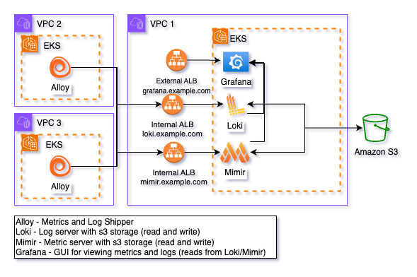

# Deploying a Comprehensive Observability Stack with Helm
Monitoring and observability are essential for maintaining modern infrastructure and applications. With the new Observability Helm Chart, setting up a robust monitoring system is easier than ever. This chart provides an integrated stack featuring Grafana for visualizations, Loki for log aggregation, and Mimir for metrics storage and querying. Alloy can then be deployed in any cluster to collect logs and metrics to foward to Loki and Mimir. Additionally, you can optionally deploy the Faro Collector Helm Chart to further enhance observability by supporting Real User Monitoring (RUM) via the Fence Service.

## Overview of the Observability Helm Chart
The Observability Helm Chart deploys a complete observability solution to your Kubernetes cluster. It bundles three core components:

### Grafana:
An industry-leading visualization platform that allows users to create dashboards, track metrics, and set alerts.
### Mimir:
A scalable time-series database optimized for efficiently storing and querying metrics across applications and infrastructure.
### Loki:
A log aggregation system designed to index and query logs with minimal resource usage, seamlessly integrating with Grafana.

## General Architecture

In this setup, Loki and Mimir are configured with internal ingress resources, enabling Alloy to send metrics and logs securely via VPC peering connections. Both Loki and Mimir write the ingested data to Amazon S3 for scalable and durable storage. This data can be queried and visualized through Grafana, which is hosted behind an internet-facing ingress. Access to Grafana can be restricted using CIDR ranges defined through the ALB ingress annotation: alb.ingress.kubernetes.io/inbound-cidrs: "cidrs". Additionally, the chart supports SAML authentication for Grafana, configured through the grafana.ini field, ensuring secure user access.

### Fips compliant images

Gen3 provides FIPS-compliant images, which are set as the default in the values file for Grafana, Mimir, and Loki. These images are self-hosted and maintained by the Gen3 Platform Team, ensuring secure and compliant operations. The Platform Team is responsible for managing image upgrades, and service versions will be updated as deemed necessary by the team.

### Built-in Gen3 Alerts

This Helm chart comes equipped with built-in Gen3 alerts, defined in the 'alerting' section of the values.yaml. These alerts enable you to immediately leverage your logs and metrics as soon as Grafana is up and running.

### Built-in Gen3 Dashboards

You can utilize Gen3-specific visualizations by visiting our [grafana-dashboards repo](https://github.com/uc-cdis/grafana-dashboards)

## Alloy and Faro: Enhancing Observability

### Alloy:
Collects logs and metrics from your services and sends them to Loki and Mimir for storage and analysis. Alloy acts as a bridge between your services and the observability stack, ensuring data flows smoothly to the right destinations.
### Faro Collector:
A specialized configuration of Alloy designed to collect Real User Monitoring (RUM) data from Grafana Faro. This setup captures frontend metrics.

## Helm Charts Overview
Observability Helm Chart: Deploys Grafana, Loki, and Mimir as the foundation of your observability platform.

Alloy Helm Chart: Configures Alloy to collect logs and metrics and forward them to Loki and Mimir. Alloy can be deployed in a separate cluster or VPC or it can be deployed in multiple clusters/vpcs.

Faro Collector Helm Chart: Adds RUM data collection to the stack by configuring Alloy to receive frontend metrics from Grafana Faro.

## Conclusion
This new suite of Helm charts provides everything you need to monitor your Gen3 instance.

To see detailed instructions on how to set up these charts, please refer to the following links:

- [Observability](../../gen3-resources/operator-guide/tutorial_observability.md)
- [Alloy](../../gen3-resources/operator-guide/tutorial_alloy.md)
- [Faro](../../gen3-resources/operator-guide/tutorial_faro.md)
