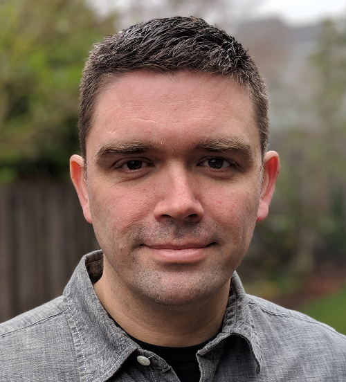
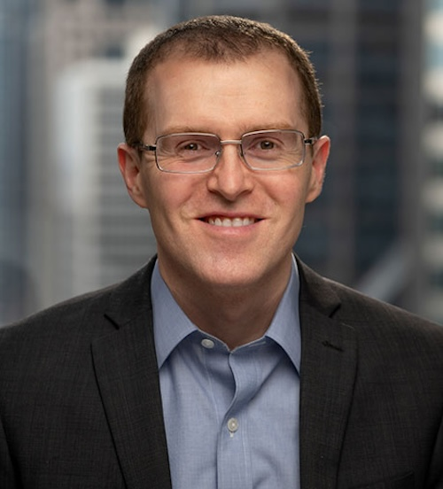
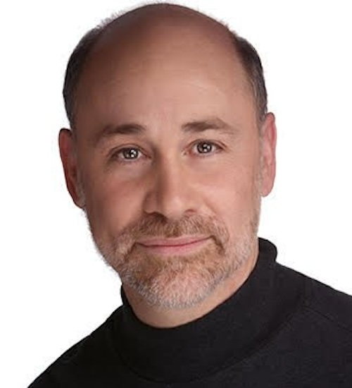
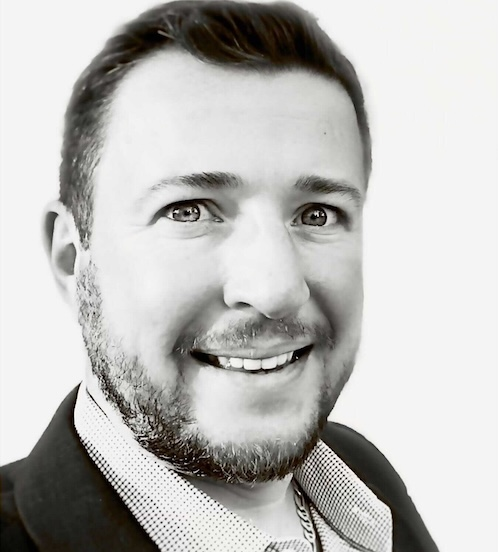
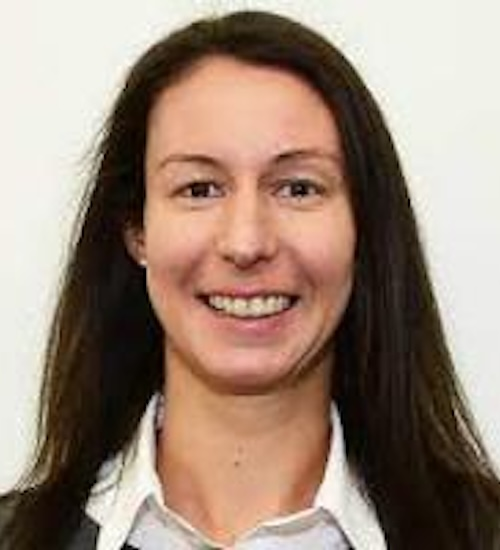

# Gen3 Mission

Gen3 aims to accelerate and democratize the process of scientific discovery by making it easy to manage, analyze, harmonize, and share large and complex datasets.

## Gen3 Community Steering Committee

As the Gen3 community continues to grow worldwide, we seek to maintain an open and vibrant space for intellectual exchange around data sharing and analysis. The Gen3 Community Steering Committee serves to uphold the Gen3 mission by ensuring Gen3 development activities and events are aligned with the needs of our growing community. As the work of Gen3 expands, the steering committee may create working groups to focus on particular themes or products.

**Gen3 Community Steering Committee**

Kyle Ellrott, Ph.D.

Associate Professor of Computational Biology
Oregon Health and Science University

Michael Fitzsimons, Ph.D.

Director of Research Programs and Scientific Outreach
University of Chicago

Robert Grossman, Ph.D.

Professor of Medicine and Computer Science
University of Chicago

Steven Manos, Ph.D.

Associate Director of Cyberinfrastructure
Australian BioCommons

Plamen Martinov

Chief Technology and Security Officer
Open Commons Consortium

Claire Rye, Ph.D.

Project Manager for Data
New Zealand eScience Infrastructure
