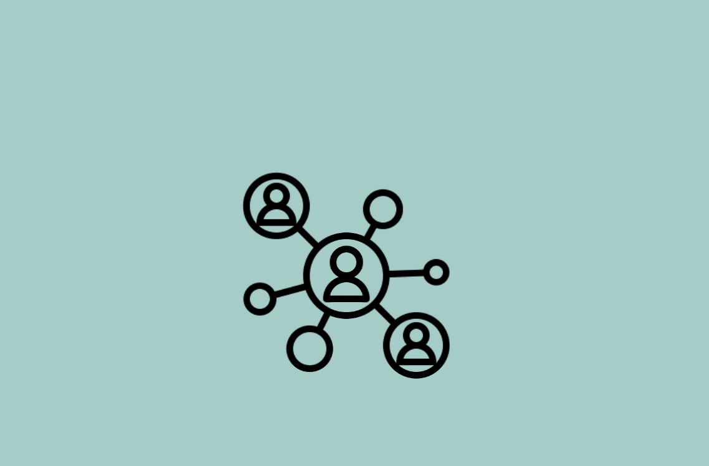

# Gen3 Community

Welcome to the Gen3 Community! Learn from our Community members and engage in technical discussions. Find resources below to discover helpful information on the Gen3 Data Platform Community that strives to accelerate data-driven discoveries.

## Gen3 Code of Conduct

The Gen3 Community values respect and professionalism. Our purpose is to share knowledge and make everyone feel safe and included.
    button:
      link: https://forums.gen3.org/t/faq-guidelines/5

## Join our Slack!

This is where we gather to ask questions and learn from others' experiences.
    button:
      link: https://docs.google.com/forms/d/e/1FAIpQLSczyhhOXeCK9FdVtpQpelOHYnRj1EAq1rwwnm9q6cPAe5a7ug/viewform

## Help Desk

For assistance with urgent or project specific questions, please contact our help desk.
    button:
      link: https://gen3.org/resources/user/#contact-ctds-staff

## Gen3 Projects

Gen3 is ever changing. Check out our current projects.
    button:
      link: /powered-by-gen3

## Discussion Board

Discuss use and development of the Gen3 software suite. Find different topics and answers.
    button:
      link: https://forums.gen3.org

## Gen3 Videos

Dig deep into our videos and webinars to see Gen3 configurations and operations.
    button:
      link: https://www.youtube.com/channel/UCMCwQy4EDd1BaskzZgIOsNQ/featured

## Source Code

View repositories for all Gen3 services on GitHub.
    button:
      link: https://github.com/uc-cdis

## Gen3 Publications

Follow the discoveries being made by Gen3 researchers.
    button:
      link: /gen3refs/

## Community Events

View information about and register for upcoming Gen3 developer community events.
    button:
      link: /community/events/

## Release Notes

Learn what improvements were found in the latest releases.
    button:
      link: https://github.com/uc-cdis/cdis-manifest/tree/master/releases

## Contribute to Gen3

Learn how to contribute code improvements to Gen3.
    button:
      link: https://uc-cdis.github.io/gen3-docs/docs/Contributor%20Guidelines

## Frequently Asked Questions

Review the most common questions and answers
    button:
      caption: FAQ
      link: /resources/faq/

## Get Started Easily
View tutorials on using Gen3, including setup and configuration.
    button:
      caption: Easy Start
      link: /get-started
