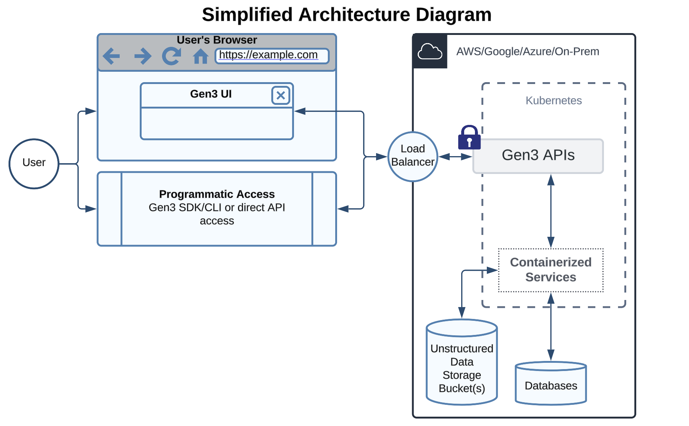
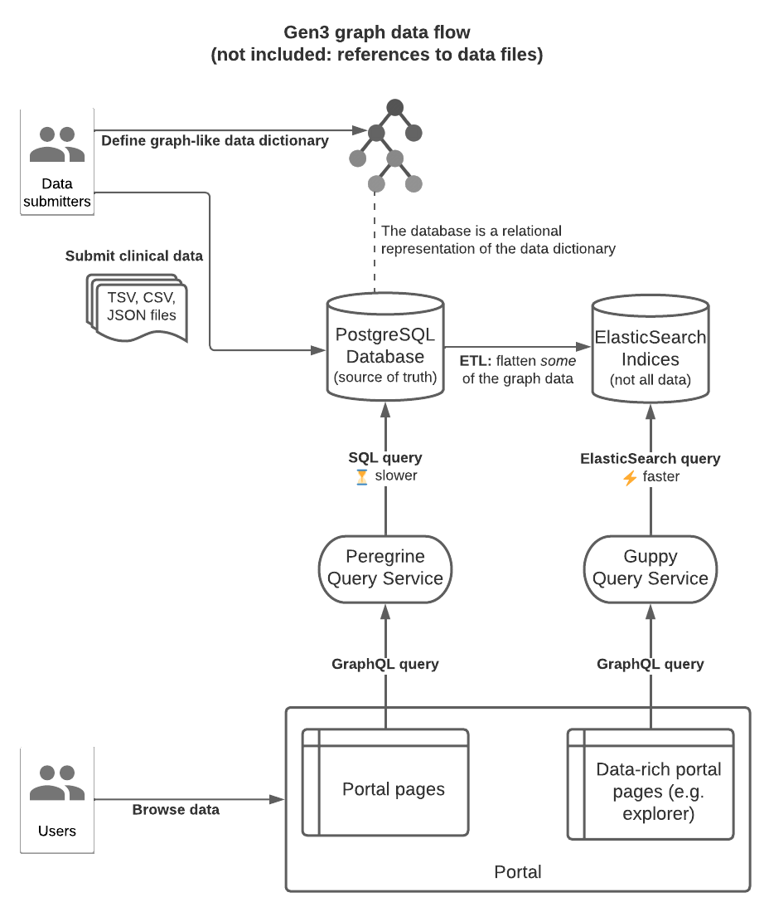

This documentation is intended for developers who want to understand the design and architecture of Gen3.

## Overview

Gen3 is a modular, open-source software platform that exposes a standard set of application programming interfaces (APIs) and user interfaces (UIs). It is capable of managing various types of cloud-based data and enabling cloud-based compute over those data.

The underlying software and APIs are designed from the ground up to be interoperable, standards-based, and configurable.  The Gen3 software is intended to be cloud-agnostic and its deployment is facilitated by containerization and orchestration frameworks such as Kubernetes.

> NOTE: While cloud-agnostic, we (the Center for Translational Data Science, maintainers of Gen3) use AWS internally for most instances of Gen3 we manage, and therefore some documentation may include AWS specific instructions.

Gen3 can handle various categories of data based on their structure. 

**Unstructured** data represents files on a hard drive or cloud storage with no consistent schema. These data tend to represent either bulk clinical and phenotypic data in spreadsheet format or patient level data such as images or genomic sequencing files.

**Structured** data are data that adhere to a specific and strict schema with a graphical representation of nodes with properties and relationships to other nodes. This schema can be referred to as a data model or data dictionary and tends to represent clinical and phenotypic data, linking subjects and their clinical and phenotypic data to studies and their samples. This is typically used to represent a harmonized version of the data.

**Semi-structured** data is organized as unique identifiers with flexible key/value pairs (including nesting). The key/value pairs may be consistent between records, but are not required to be. This is typically used for storing publicly available metadata about available datasets or additional public metadata about samples.

The overall architecture is designed to support FAIR data access[[1]](architecture.md#references), which includes features such as permanent digital IDs, open APIs, rich clinical and experimental data, and services modeled from external standards such as from GA4GH.  Gen3 data meshes go one step further and support Secure and Authorized FAIR Environment (SAFE) environments[[2]](architecture.md#references).

## Products

The distinct Gen3 products include Gen3 Data Commons, Gen3 Data Meshes, Gen3 Framework Services, and Gen3 Analytic Workspaces. Each product represents common applications and use cases with a subset of Gen3 UIs and APIs made available.

### Gen3 Data Commons

Gen3 Data Commons co-locate exploration and visualization tools with data management services for import and export of structured information like clinical, phenotypic, or biospecimen data, along with data objects, like genomics data files or medical images. Gen3 Data Commons are capable of interoperation with other resources in a data mesh (AKA fabric or ecosystem) by utilizing the Gen3 Framework Services.

### Gen3 Data Meshes

A Gen3 Data Mesh connects independent data resources into a single interoperable data ecosystem. The APIs provided as part of this product include support for indexing data objects, associating metadata with the data objects, associating metadata with each data resource, controlling user access to data via a flexible access control policy engine, a graphical user interface, and workspaces that run over the open APIs.

The level of integration in a data mesh can vary greatly. In a very integrated scenario, all data has a single data model and governance structure and is in fact just a data commons.

In a less integrated scenario, data may live in separate data commons with separate data models and access control policies, but where Gen3 indexes and associates metadata with files, provides GUIDs (Globally Unique Identifiers) for all files, provides access control, and exposes open APIs.

On the least integrated side of the spectrum, Gen3 may provide only dataset-level metadata to make datasets discoverable and enable workspaces.

### Gen3 Framework Services

Gen3 Framework Services are a minimal set of software that provide open APIs and UIs that form the foundation, or “framework”, for building systems. Such foundational support includes indexing data objects, associating metadata with the data objects, controlling user access to data via a policy engine, and providing a data discovery UI.

Gen3 framework services can be deployed alone and other desired functionality can be built off the extensive open APIs. It is more common that they are deployed as part of a broader product like Gen3 Data Commons or a Gen3 Data Mesh.

Gen3 Framework Services aim to provide mechanisms to enable data to be fully Findable, Accessible, Interoperable, and Reusable (FAIR). One of the guiding principles of Gen3 as a whole, but most importantly the Gen3 Framework, is to use existing standards and solutions to common problems. This is why standards like OpenID Connect, OAuth 2.0, and GA4GH DRS have been adopted. We aim to adopt community standards and solutions when they provide an interoperable solution in an efficient way.

### Gen3 Analytic Workspaces

Gen3 Analytic Workspaces support secure data analysis environments in the cloud that can access data from one or more data resources, including Gen3 Data Commons.

Gen3 workspaces are often fully integrated with a specific data commons, and coming soon are workspaces as stand-alone analysis environments with a user pay model. Workspaces use the Gen3 Framework Services for user authentication and authorization and for retrieving data objects and metadata from data resources, like Gen3 Data Commons.

By default, Gen3 workspaces include Jupyter notebooks and RStudio but can be configured to host virtually any application, including analysis workflows such as Nextflow, data processing pipelines, or data visualization apps. In the future, the Gen3 Workflow Execution API will enable asynchronous and long-running workflows and pipelines to be executed.

## Security

Gen3 is designed to enable organizations to support secure and compliant data sharing and analysis solutions, but security and compliance regulations and concerns may vary from project to project. To discuss Gen3 security and compliance it is useful to first identify the players or stakeholders involved in a Gen3 production system.

* Gen3 development team at the University of Chicago
* An infrastructure or platform provider like AWS, Azure, or a private cloud
* The Gen3 operator or technical team maintaining the Gen3 deployment
* The project sponsors who commission the Gen3 instance around a scientific research question

### Gen3 Development Team at the University of Chicago

* Provides stable, secure Gen3 releases and appropriate communications with the open-source community.

Note: The Gen3 team is responsible for providing a solid foundation for the Gen3 platform, but external factors like infrastructure providers and operators will also impact the overall security and compliance posture.

### Infrastructure or Platform Provider (e.g. AWS, Azure, Private Cloud)

* Responsible for physical security controls and measures.
* May be the same as the sponsor or technical operator if deployed on institutional on-premises infrastructure.

Interaction Note: The Gen3 team relies on the infrastructure provider to ensure the underlying security measures are in place. However, the Gen3 operator is still responsible for understanding applicable laws and regulations.

### Gen3 Operator or Technical Team

* Responsible for:
	+ Understanding all applicable laws and regulations for compliance
	+ Gen3 configurations
	+ CI/CD flow
	+ Platform operation and monitoring architecture
	+ Continuous Monitoring (ConMon)
	+ Policies and procedures related to the specific deployment
	+ Tools deployed outside of Gen3
* Needs a good understanding of security best practices and laws governing their specific deployment, use case, and data.

> NOTE: It is highly recommended that Gen3 operators keep their deployment on the latest monthly release of Gen3

Interaction Note: The Gen3 operator is responsible for ensuring compliance with applicable laws and regulations, but relies on the infrastructure provider to ensure the underlying security measures are in place. The project sponsor may also define specific requirements that the technical operator will configure in Gen3.

### Project Sponsors

* May define specific use cases or requirements that the technical operator will configure in Gen3.
* Responsibilities include commissioning the Gen3 instance around a scientific research question.

Interaction Note: The sponsor commissions the Gen3 instance, but does not directly manage its operation. The technical operator and Gen3 team must work together to ensure compliance with applicable laws and regulations while meeting the sponsor's requirements.

Many of the CTDS-run commons operate at a FedRAMP (Federal Risk and Authorization Management Program) Moderate level as Gen3 Data Ecosystems Platform and, in collaboration with the Open Commons Consortium, LI-SaaS (Low Impact Software as a Service) as Gen3 Data Commons Service. However, other operators can choose to run a Gen3 system at a higher or lower security standard.

## Key Features

### Scalability

Gen3 can be used as a tool to manage small to very large projects.  This inherent flexibility is embedded in several Gen3 features:

* Gen3 is cloud-agnostic and can be run on any commercial cloud as well as on-prem infrastructure.  This will allow a range of groups to take advantage of the software given the requirements of different organizations.
* It takes advantage of kubernetes, which is an open-source system for automating deployment, scaling, and management of containerized applications.
* Our installation uses Karpenter, which is an open-source Kubernetes cluster autoscaler.  This allows a project to easily transition as it gains more or fewer users over a long or short period of time.
* Helm charts, which is a kubernetes package manager, allows operators to quickly deploy a new system.
* The use of terraform scripts allow operators to efficiently manage both Gen3 and infrastructure resources.

### Data Model

The Gen3 data model is a graph-like relational model with nodes and edges; it specifies how different files, patients, experiments, and clinical visits are all related to one another.  It is central to a Gen3 Data Commons, which is autogenerated after the data dictionary and data model are specified.

To be more specific, each node represents an entity, which consists of a related group of attributes or data elements. Clinical variables like a cancer diagnosis or a subject’s gender might go into the diagnosis or demographic nodes, respectively. Variables related to how a biological sample was collected or processed may be found in a biospecimen node. Data files, such as medical images or genomic files, can also be nodes and have associated metadata variables like file size, format, and file name.

Edges or links between nodes indicate relationships between them. For example, a Sample node may derive or connect to a specific patient or a genomic data file may also be associated with a specific sample.

Properties are assigned different types including: string, boolean, floating point number, integer, or enumeration. Properties can also be defined as arrays of any of those types. The acceptable values for properties can be further restrained by defining regex patterns that strings must match or minimum or maximum values for numeric data. Nodes, properties, and permissible values are specified in a series of YAML files.

### Data Portal

Since the launch of Gen3, the user interface has been powered by the monolithic Gen3 Data Portal. Its design presents challenges in data movement between pages and has become increasingly difficult to extend.

We are developing a new service, the Gen3 Frontend Framework (Gen3.2), to overcome these limitations. It offers enhanced custom content development, application performance, deployment, and maintenance. As we transition to the new framework, we will focus on the Gen3 Frontend Framework rather than the soon to be replaced Gen3 Data Portal.

The Gen3 Frontend Framework consists of two primary modules—core and frontend—combined with a NextJS web application to create the Gen3 data commons UI. This architecture reduces code complexity, abstracts UI interactions with Gen3 services, supports customization, and simplifies deployment and cost.

The core module interfaces with Gen3 services and analysis tools, managing user context. This includes the current cohort, selected studies, files, and active analysis tools. The module provides Gen3 services and API access via “hooks,” allowing seamless data reading and updates. This design isolates pages and components from Gen3 API changes and standardizes service access. Additionally, the core module features the Analysis Tool Framework (ATF), which supports the development of applications using Gen3 services and third-party APIs. The ATF maintains a registry of tools, along with metadata describing their applicable contexts.

The frontend module delivers standard Gen3 pages (Exploration, Discovery, Query, Data Dictionary, Workspace, and Profile), new Gen3 components, theming, and configuration support. Components leverage hooks from the core module to access Gen3 services. The module supports authenticated and access-controlled pages and applications through a Secured Content Provider wrapper. It also handles the registration of analysis tools with the ATF.

Analysis tools are developed using React, Gen3 core/frontend packages, and custom code. These tools are published as NPM modules and registered as plugins with the ATF during the server build, making them accessible via the data commons’ root URL.

## Architectural Diagrams

### Architecture Overview

### Gen3 Graph Data Flow

## References

1. Wilkinson, M., Dumontier, M., Aalbersberg, I. et al. The FAIR Guiding Principles for scientific data management and stewardship. Sci Data 3, 160018 (2016). https://doi.org/10.1038/sdata.2016.18
2. Grossman, R.L., Boyles, R.R., Davis-Dusenbery, B.N. et al. A Framework for the Interoperability of Cloud Platforms: Towards FAIR Data in SAFE Environments. Sci Data 11, 241 (2024). https://doi.org/10.1038/s41597-024-03041-5
