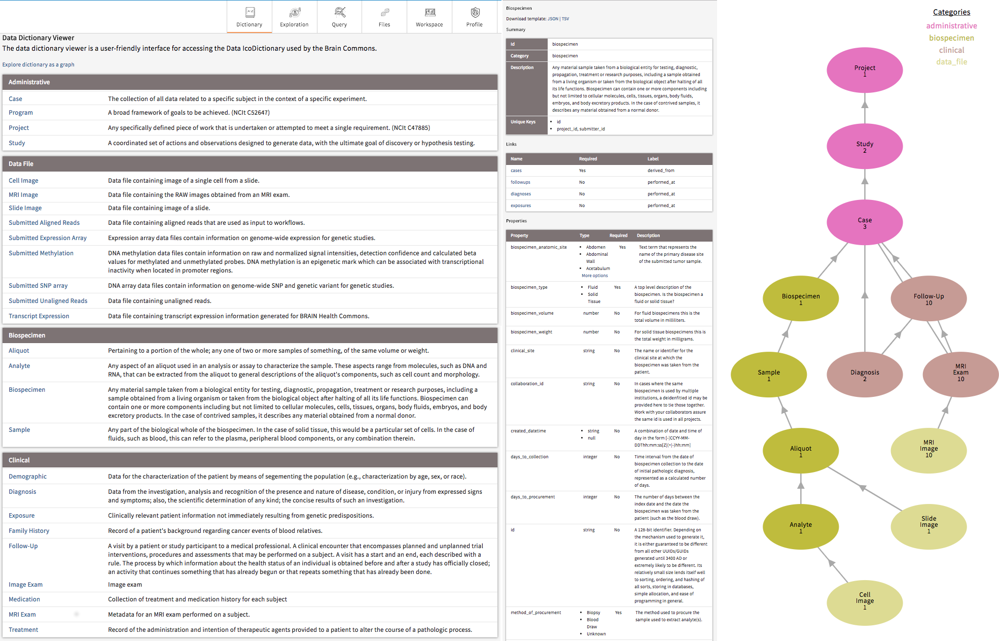

# Creating a New Data Dictionary

Every Gen3 data commons employs a data model, which serves to describe, organize, and harmonize structured data. Data harmonization facilitates cross-project analyses and is thus one of the pillars of the data commons paradigm. The data model organizes experimental or clinical variables, “properties”, into linked categories, “nodes”, through the use of a data dictionary. The data dictionary lists and describes all nodes in the data model, as well as defines and describes the properties in each node. A Gen3 Data Dictionary is specified by a YAML file per node.  A dictionary needs to be defined to allow submission of structured metadata and use of the [Exploration Page][Exploration Page] in the Data Portal.

A few example nodes are listed below:

* Clinical variables like a "primary cancer diagnosis" or a subject's "gender" might go into the "diagnosis" or "demographic" nodes, respectively.
* Sample-related variables like "how a tumor sample was collected" and "what analyte was extracted from it" might go into the "biospecimen" or "analyte" nodes, respectively.
* Data files also have associated metadata variables like file size, format, and filename. These properties are grouped into nodes that describe various types of data files, like "mri_image", for an MRI image data file.

Each node in the data dictionary is linked in a logical manner to other nodes, which facilitates generating a visual overview, or graphical model, of a project.

The following image displays the data dictionary in Table View, the 'Medical History' node entry in the dictionary with the list of properties, and an example graphical model of a project:




## Core Dictionary
If you have followed our helm deployment instructions we have created a basic [data dictionary][datadictionary github] to get you started.  You can use the default Data Dictionary as a starting point for creating your own data dictionary in your own commons. It is a consensus of previously used data dictionaries and will make creating your own data dictionary more efficient. It is easy to replace the default dictionary at deployment as long as you have 1) not submitted any data to the default dictionary and 2) ETL mapping has not occurred with the default dictionary.


A list of some example data dictionaries are included below, which you can review for potential ideas or examples for how to capture specific data types:


| Data Commons  | Dictionary Viewer | Dictionary Repo |
| :---------------- | :------: | ----: |
| [Data Commons Framework Services][NCI DCFS] |   [DCFS Dictionary][DCF dictionary viewer]  | [GitHub][datadictionary github] |
| [Medical Imaging and Data Resource Center (MIDRC)][MIDRC] |   [MIDRC Dictionary][MIDRC dictionary viewer]  | [GitHub][MIDRC data dictionary] |
| [Justice Community Opiod Innovation Network (JCOIN)][JCOIN] |   [JCOIN Dictionary][JCOIN dictionary viewer]   | [GitHub][JCOIN data dictionary] |


The basic structure of this and all dictionaries includes the following node categories:

### Node Categories
#### Administrative
The Project, Study, and Subject nodes are administrative nodes that are required for any Gen3 data commons. Administrative nodes store basic project and study information for their associated cases or subjects.  Also, the Subject node level is where the nodes start differentiating between commons.  It can also be represented as Case depending on the use case.

#### Clinical
The Subject node links to the Demographic and Diagnosis clinical nodes. These nodes are Clinical nodes that are used to store clinical and medical history related data. The Demographic node stores properties that represent the statistical characterization of human populations or segments of human populations (for example, characterization by year of birth, sex, and race). This node is typically used to store properties that do not change over time. The Diagnosis clinical node represents the investigation, analysis, and recognition of the presence and nature of disease, condition, or injury from expressed signs and symptoms. It also pertains to the scientific determination of any kind and the concise results of such an investigation.

#### Biospecimen
The Biospecimen node category is associated with data related to biological specimens as it relates to testing, diagnostic, propagation, treatment or research purposes.  This node can contain one or more components including but not limited to cellular molecules, cells, tissues, organs, body fluids, embryos, and body excretory products.  It is composed of nodes such as Sample, Aliquot, and Read Group.  For example, in some commons Sample can represent an actual piece of tissue removed from a biological entity for testing, diagnostic, propagation, treatment or research purposes and an aliquot represents a nucleic acid extraction from this tissue.  The number of biospecimen nodes can be tuned for a particular commons depending on the desired level of granularity required.  Read group refers to sequencing read group and can be important for commons that require bioinformatics processing of sequencing data.

#### Analysis
The Analysis node category stores data that is associated with genomic pipeline analysis that is typical of next generation sequencing (NGS).  Example Analysis nodes include Genotyping Array Workflow which stores metadata for genotyping array workflow, the Proteomic Workflow node  which stores metadata for the protein mass spectrometry workflow, and the Aligned Workflow node which stores metadata for alignment pipeline used to align reads.

#### Data File
The Data File node category is used to store metadata related to data files that are stored in the cloud. It contains nodes such as Submitted Aligned Reads, Submitted Unaligned Reads, and Aligned Reads.  These nodes contains properties such as file_name, file_size, and data_format which describe information stored in the file.

#### Index File
The Index File node category stores the metadata that is associated with different file formats (for example, BAI and BAM).  For example, the Aligned Reads Index node contains the index for a set of aligned reads.

#### Notation
The Notation node category is used to store data that does not fit into other categories (for example, it doesn't store index files, data files, or analysis data).  The ability to update/modify a dictionary is an important functionality that may arise based on project and clinical data needs.

The following image depicts the graph view of the core data dictionary (The key in the top right corner of the image indicates the node categories):


## Modifying a Data Dictionary
Once you have obtained the baseline dictionary, you can make updates to it in order to tailor it to your particular project. Some groups have created open-source tools for editing data dictionaries using other methods, such as [gen3schemadev][gen3schemadev], which interconverts YAML schemas with TSV format spreadsheets. This tool and others like it found on the [Gen3 Tools Page][Gen3 Tools] may be useful.

> Note: The Gen3 dictionary is stored in JSON format following the [jsonschema](https://cswr.github.io/JsonSchema/spec/basic_types/). The backend (Sheepdog) stores properties in the database as jsonb.

### Referencing external data standards
It is possible to include references to controlled vocabularies such as the [National Cancer Institute Thesaurus (NCIt)][NCIthesaurus].  This will help with the comparison of studies and projects across data commons and provide researchers with proper references.  The NCIt is being used for many of the schemas as it's inclusive of several different domains (for example, clinical, drug, etc.).  It also has an abundance of non-domain related terms such as nominal (for example, gender and race) and ordinal (for example, left, right, first, and last) along with other useful categories of terms.  The benefit of this effort is that it will facilitate cross data commons comparison.  For instance, if tuberculosis is a term associated with multiple studies, a search of that term will provide insight into each of the studies.  It will also help with the prevention of adding multiple terms for properties that mean the same thing.  The example below demonstrates a cross-study comparison using YAML files (Gen3 uses YAML files to help organize data dictionaries).  The two files both relate to blood pressure finding, but each has a different term name.  The external reference helps with harmonization efforts by helping identify terms that have the same meaning.

```
Dictionary 1:
Blood Pressure Measurement:
    description: Measurement of blood pressure
    enum:
      - 90 over 60 (90/60) or less
      - More than 90 over 60 (90/60) and less than 120 over 80 (120/80)
      - More than 120 over 80 and less than 140 over 90 (120/80-140/90)
      - 140 over 90 (140/90) or higher (over a number of weeks
    termDef:
       - term: Blood Pressure Finding
         source: NCI Thesaurus
         term_id: C54707
         term_version: 18.10e (Release date:2018-10-29)
         term_url: "https://ncit.nci.nih.gov/ncitbrowser/ConceptReport.jsp?dictionary=NCI_Thesaurus&ns=ncit&code= C54707"
Dictionary 2:
Blood Pressure Reading:
    description: An indication of blood pressure level
    enum:
      - low blood pressure
      - normal
      - pre hypertension
      - hypertension
    termDef:
       - term: Blood Pressure Finding
         source: NCI Thesaurus
         term_id: C54707
         term_version: 18.10e (Release date:2018-10-29)
         term_url: "https://ncit.nci.nih.gov/ncitbrowser/ConceptReport.jsp?dictionary=NCI_Thesaurus&ns=ncit&code= C54707"
```
## Best Practices

### Data Harmonization
When adding a new project or study into a new or an already existing data dictionary, it's important to follow the process of harmonization of data.  The harmonization process centers around updates or additions to the data dictionary, along with the possible need to harmonize the data. This process helps with the prevention of redundant properties, nodes, and allowable values that may already exist in a data dictionary.  It also involves the possibility of a data migration if the data dictionary changes affect the preexisting data (for example, the height property unit of measure change from meters to centimeters).  Before submitting new data to a commons or submitting updates to a data dictionary, check the current dictionary for properties, nodes, or enumerated values that already exist.  If there is a similar property, node, or enumerated value that exists, it's best practice to use the existing node, property, or enumerated value.  For example, if a candidate property named “infection agent” and a property named “infectious agent” already exist, then use “infectious agent.”

### Specificity vs. Generality

One of the goals when providing an external reference is to figure out the level of specificity when breaking down a property name that contains multiple concepts.  The question is whether the new references should be created with very specific designations. This is known as **pre-coordination**.   This option would likely create the need for the request of new terms in the external standard if the term is not in existence. The other question is, should the use of multiple terms that already exist in an external standard be used? This is known as **post-coordination**?  The best practice adopted by Gen3 is to use specificity whenever corresponding terms are available in the external standard.  However, If specific terms are not available, lean towards generality by creating multiple terms that already exist in an external standard.  For instance, if grapefruit juice is a property of interest and it's not found in the external reference, but grapefruit and juice are found individually, then using the individual properties is the preferred method.

### Creating Valuable Data Descriptions

It's important to create clear and concise descriptions for each property in a dictionary. The descriptions should be understandable by someone who is not familiar with a particular domain. When available, including the unit of measure in parenthesis at the end of the description would be helpful in cases where the unit of measure is not included elsewhere in the description. When a clear description is not readily available, it's recommended that an external vocabulary such as NCIt be used as they offer definitions for terms from a plethora of domains.

### Representing Longitudinal Data

Gen3 does not recommend the reporting of actual dates as they are considered PHI. Instead, the concept of date intervals can be used in its place. Properties such as `days_to_birth`, `days_to_death`, `days_to_last_follow_up`, and `days_to_treatment` provide a means to keep track of timing between visits while protecting study participant identities. These properties begin with the same date, which is called the index date. The index date is day 0 and any event that occurs before that date is a negative number and any event that occurs after that date is a positive number. For example, if `days_to_birth` is -12784 and the index date is diagnosis, this means that the participant was born 12,784 days prior to the diagnosis given the negative number. It also infers that the patient was 35 at diagnosis.

Gen3 provides the ability to store longitudinal data. A clinical node that is not included in the core dictionary is the Visit or Follow-Up node. The Visit node is a clinical node that is used to store longitudinal data that is collected over time and usually has a many to one relationship with its parent node, meaning that an observation/response was observed for a subject/unit repeatedly over time. Clinical properties that are common for this node include height, weight, and BMI (body mass index). If the need arises, the node can be added to a data dictionary.

### Selecting the Property Type

The Gen3 model allows for a selection of property types that can be used to specify or limit values submitted for each property.
The available types are [jsonschema types](https://cswr.github.io/JsonSchema/spec/introduction/) such as:

* string [example](https://github.com/uc-cdis/openaccess_dictionary/blob/415bf61707ba55a6772423c461da3f16eef9c451/gdcdictionary/schemas/drug.yaml#L274)
* boolean [example](https://github.com/uc-cdis/openaccess_dictionary/blob/415bf61707ba55a6772423c461da3f16eef9c451/gdcdictionary/schemas/drug.yaml#L79)
* number [example](https://github.com/uc-cdis/openaccess_dictionary/blob/415bf61707ba55a6772423c461da3f16eef9c451/gdcdictionary/schemas/drug.yaml#L354); can be float, long, or double as shown [here](https://json-schema.org/understanding-json-schema/reference/numeric.html).
* integer [example](https://github.com/uc-cdis/openaccess_dictionary/blob/415bf61707ba55a6772423c461da3f16eef9c451/gdcdictionary/schemas/drug.yaml#L418)
* enum [example](https://github.com/uc-cdis/openaccess_dictionary/blob/415bf61707ba55a6772423c461da3f16eef9c451/gdcdictionary/schemas/drug.yaml#L401)
* array [example](https://github.com/uc-cdis/openaccess_dictionary/blob/415bf61707ba55a6772423c461da3f16eef9c451/gdcdictionary/schemas/expression_result.yaml#L150)
* regex patterns (including strings, integers, and numbers to modify the format) [example](https://github.com/uc-cdis/openaccess_dictionary/blob/415bf61707ba55a6772423c461da3f16eef9c451/gdcdictionary/schemas/_definitions.yaml#L103)
* null [example](https://github.com/uc-cdis/openaccess_dictionary/blob/415bf61707ba55a6772423c461da3f16eef9c451/gdcdictionary/schemas/_definitions.yaml#L80)
* object [example](https://github.com/uc-cdis/openaccess_dictionary/blob/415bf61707ba55a6772423c461da3f16eef9c451/gdcdictionary/schemas/_definitions.yaml#L47)

### Avoiding Data Loops

When creating a data model it's important to avoid loops or cycles between nodes.  A cycle is created when a relationship between nodes is created on top of an already existing chain of relationships.  In other words, loops occur when one relationship is completely derivable from combined relationships that already exist.  Loops have a negative effects on down stream functions and tools such as ETL mappings and elastic search.

The following diagram is an example of a loop as R3 is redundant as it brings no new associations that are not already presented by the combination of R1 and R2:


### Dictionary Update Documentation

When making updates to data dictionaries, it's important to document these changes for good record keeping purposes.  The documentation should be implemented in the release notes of the respective GitHub site.  All changes should be denoted from minor to major changes.  Common updates include enumerated value modifications, adding or removing properties or nodes, and updates to links that describe relationships and dependencies between nodes.  Every release is associated with a unique tag which differentiates dictionary versions.  The tags are incrementally changed based on how extensive an update (for example, for a minor update such as changing a property name version 3.3.2 would become 3.3.3).

#### Example Release Notes

      Gen3 Product: Sample Data Hub
      Release Date: May 30, 2019
      New Features and Changes

      Create the following node:
      sample

      Add the following properties to the sample node:
      sample_name
      sample_time

      Remove the following properties from the demographic node:
      sex
      height

      Add new link:
      sample to visit node

Proper documentation of dictionary updates fosters accountability and creates a historical representation of all dictionary changes that will allow future operators of the dictionary to understand how the dictionary has evolved over time.

When generating the release notes there are [conventions][release notes conventions] that have been established that help with transparency and readability of release notes.  The conventions include:

  1. Start the subject line with a verb (for example, Update to enumerated value)
  2. Use the imperative mood in the subject line (for example, Add, not Added or Adds header styles)
  3. Limit the subject line to about 50 characters
  4. Do not end the subject line with a period
  5. Separate subject from body with a blank line
  6. Wrap the body at 72 characters
  7. Use the body to explain what and why, not how


<!-- Creating a Data Dictionary -->
[Exploration Page]: ../user-guide/portal.md/#exploration-page
[datadictionary github]: https://github.com/uc-cdis/datadictionary/
[NCI DCFS]: https://nci-crdc.datacommons.io/login
[DCF dictionary viewer]: https://nci-crdc.datacommons.io/dd
[MIDRC]: https://www.midrc.org/
[MIDRC dictionary viewer]: https://data.midrc.org/DD
[MIDRC data dictionary]: https://github.com/uc-cdis/midrc_dictionary
[JCOIN]: https://jcoin.datacommons.io/
[JCOIN dictionary viewer]: https://jcoin.datacommons.io/DD
[JCOIN data dictionary]: https://github.com/uc-cdis/JCOIN_datadictionary

<!-- Modifying a data dictionary -->
[gen3schemadev]: https://github.com/AustralianBioCommons/gen3schemadev
[Gen3 Tools]: https://gen3.org/gen3-tools/
[NCIthesaurus]: https://ncithesaurus.nci.nih.gov/ncitbrowser/
[release notes conventions]: https://github-tools.github.io/github-release-notes/concept.html
