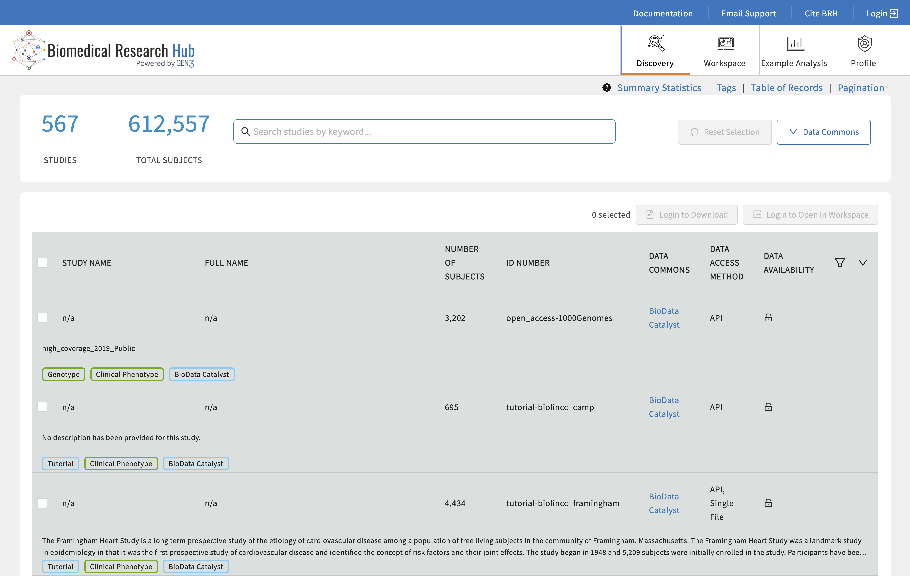

---
tags:
  - submission
---

# Semi-structured Data

Semi-structured data is organized as unique identifiers with flexible key/value pairs (including nesting). The key/value pairs may be consistent between records, but are not required to be. This is typically used for storing publicly available metadata about available datasets or additional public metadata about samples. In Gen3, semi-structured data can be stored in the [Metadata Service (MDS)][MDS] or the [Aggregated Metadata Service (AggMDS)][AggMDS].  Both the MDS or AggMDS can power the Data Portal Discovery Page.

Because the structure of a commons' MDS and the Discovery Page configuration are very closely coupled, all content related to creating MDS records are included in the [Customize Gen3 Search Interface Section][Customize Gen3 Search Interface Section].

Instructions for the creation and modification of an MDS record can be found here as part of the [Gen3 SDK][Gen3 SDK Discovery Page].

## Discovery Page

<!-- Links -->

[MDS]: https://github.com/uc-cdis/metadata-service
[AggMDS]: https://github.com/uc-cdis/metadata-service/blob/master/docs/config_agg_mds.md
[Customize Gen3 Search Interface Section]: customize-search.md
[Gen3 SDK Discovery Page]: https://github.com/uc-cdis/gen3sdk-python/blob/master/gen3/cli/discovery.py
