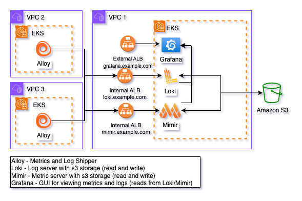

# Observability Helm Chart

Please click [HERE](https://github.com/uc-cdis/gen3-helm/blob/master/helm/observability/Chart.yaml) to view the Observability Helm Chart.

## Overview

The Observability Helm chart provides an all-in-one solution for deploying Mimir, Loki, and Grafana to your Kubernetes cluster, enabling a complete observability stack for metrics, logs, and visualization.

### Grafana
A leading open-source platform for data visualization and monitoring. Grafana allows you to create rich, interactive dashboards from a variety of data sources, making it easy to analyze metrics and logs from your systems.

### Mimir
Grafana Mimir is a highly scalable time-series database optimized for storing and querying metrics. It enables powerful alerting and querying for real-time monitoring of your infrastructure and applications.

### Loki
Grafana Loki is a log aggregation system designed to efficiently collect, store, and query logs from your applications. It works seamlessly with Grafana, providing an integrated way to visualize logs alongside metrics.

By deploying this Helm chart, you'll set up these three components together, allowing you to monitor your systems and applications comprehensively with metrics from Mimir, logs from Loki, and dashboards and alerts in Grafana.

### Alloy
Grafana Alloy is a powerful observability tool that collects and ships logs and metrics from your services to Grafana Loki and Mimir for storage and analysis.

***Note: Grafana Alloy is deployed in a separate Helm Chart. You will need to follow the instructions outlined in [alloy.md](tutorial_alloy.md) after completing the following guide.***

### Faro Collector (Alloy)
Alloy Faro Collector is a specialized configuration of Alloy that enables it to gather Real User Monitoring (RUM) data from Portal through Grafana Faro. In this role, Alloy acts as an ingestion point for RUM data.

***Note: The Faro Collector is deployed in a separate Helm Chart. You will need to follow the instructions outlined in [faro.md](tutorial_faro.md) after completing the following guide.***

## General Architecture

In this setup, Loki and Mimir are configured with internal ingress resources, enabling Alloy to send metrics and logs securely via VPC peering connections. Both Loki and Mimir write the ingested data to Amazon S3 for scalable and durable storage. This data can be queried and visualized through Grafana, which is hosted behind an internet-facing ingress. Access to Grafana can be restricted using CIDR ranges defined through the ALB ingress annotation: alb.ingress.kubernetes.io/inbound-cidrs: "cidrs". Additionally, the chart supports SAML authentication for Grafana, configured through the grafana.ini field, ensuring secure user access.



### Fips compliant images

Gen3 provides FIPS-compliant images, which are set as the default in the values file for Grafana, Mimir, and Loki. These images are self-hosted and maintained by the Gen3 platform team, ensuring secure and compliant operations. The Platform Team is responsible for managing image upgrades, and service versions will be updated as deemed necessary by the team.

### Helm Chart Links
The links below will take you to the Grafana LGTM chart, as well as the Grafana, Loki, and Mimir charts, providing a comprehensive list of configurable options to help you further customize your setup.
#### Link to lgtm Helm chart
- [LGTM Helm Chart](https://github.com/grafana/helm-charts/tree/main/charts/lgtm-distributed)
#### Full Configuration Options for all Components
- [Grafana](https://github.com/grafana/helm-charts/blob/main/charts/grafana/values.yaml)
- [Loki](https://github.com/grafana/helm-charts/blob/main/charts/loki-distributed/values.yaml)
- [Mimir](https://github.com/grafana/mimir/blob/main/operations/helm/charts/mimir-distributed/values.yaml)

### Affinity Rules

The affinity rule in the values.yaml file controls pod scheduling to specific nodes or zones. By default, pods are restricted to nodes in us-east-1a using a node label (topology.kubernetes.io/zone).

Customize these rules to align with your cluster’s zones or labels to ensure pods can schedule properly. Mismatched configurations can lead to scheduling failures.

```yaml
      affinity:
        nodeAffinity:
          requiredDuringSchedulingIgnoredDuringExecution:
            nodeSelectorTerms:
            - matchExpressions:
              # -- (string) Node label key for affinity. Ensures pods are scheduled on nodes in the specified zone.
              - key: topology.kubernetes.io/zone
                # -- (string) Operator to apply to the node selector. 'In' means the node must match one of the values.
                operator: In
                # -- (list) List of values for the node selector, representing allowed zones.
                values:
                - us-east-1a
```

### IRSA Role Setup

This Helm chart automatically creates a service account named "observability" for use with Loki and Mimir. To ensure proper access to the storage buckets holding Loki and Mimir data, you’ll need to associate an AWS IAM Role with this service account. Configure the role with the necessary permissions to access the relevant S3 buckets, and then provide the role’s ARN in the appropriate section of your values.yaml file.

```yaml
lgtm:
  #  -- (map) Configuration for IRSA role to use with service accounts.
  role:
    # -- (string) The arn of the aws role to associate with the service account that will be used for Loki and Mimir.
    # Documentation on IRSA setup https://docs.aws.amazon.com/eks/latest/userguide/iam-roles-for-service-accounts.html
    arn:
```

## Configuring Grafana

When configuring the Grafana, you will need to update the hosts section of the values.yaml file to match the hostname you plan to use. For example, replace "grafana.example.com" with your desired hostname.

### Ingress

Grafana will require an internet-facing ingress in order to access the visualizations, alerts, etc. It is highly recommended that you uncomment and adjust the annotations provided for AWS ALB (Application Load Balancer) to fit your environment (if deploying via AWS). These annotations will help ensure proper configuration of the load balancer, SSL certificates, and other key settings. For instance, make sure to replace the placeholder values such as "cert arn", "ssl policy", and "environment name" with your specific details. Access to Grafana can be restricted using CIDR ranges defined through the ALB ingress annotation: alb.ingress.kubernetes.io/inbound-cidrs: "cidrs".

```yaml
grafana:
  ingress:
    # -- (bool) Enable or disable ingress for Grafana.
    enabled: true
    # -- (map) Annotations for Grafana ingress.
    annotations:
      annotations: {}
        ## Recommended annotations for AWS ALB (Application Load Balancer).
        # alb.ingress.kubernetes.io/ssl-redirect: '443'
        # alb.ingress.kubernetes.io/certificate-arn:  <cert arn>
        # alb.ingress.kubernetes.io/listen-ports: '[{"HTTP": 80}, {"HTTPS":443}]'
        # alb.ingress.kubernetes.io/load-balancer-attributes: idle_timeout.timeout_seconds=600
        # alb.ingress.kubernetes.io/scheme: internet-facing
        # alb.ingress.kubernetes.io/ssl-policy: <ssl policy>
        # alb.ingress.kubernetes.io/tags: Environment=<environment>
        # alb.ingress.kubernetes.io/target-type: 'ip'
        # alb.ingress.kubernetes.io/inbound-cidrs: <cidrs>
    # -- (list) Hostname(s) for Grafana ingress.
    hosts:
      - grafana.example.com
    # -- (string) Ingress class name to be used (e.g., 'alb' for AWS Application Load Balancer).
    ingressClassName: "alb"
```

### Built-in Gen3 Alerts

This Helm chart comes equipped with built-in Gen3 alerts, defined in the 'alerting' section of the values.yaml. These alerts enable you to immediately leverage your logs and metrics as soon as Grafana is up and running.

### Built-in Gen3 Dashboards

You can utilize Gen3-specific visualizations by visiting our [grafana-dashboards repo](https://github.com/uc-cdis/grafana-dashboards).

## Configuring Mimir

When configuring the Mimir, you will need to update the hosts section of the values.yaml file to match the hostname you plan to use. For example, replace "mimir.example.com" with your desired hostname.

### Ingress

Mimir will require an internal ingress in order to access the visualizations, alerts, etc. It is highly recommended that you uncomment and adjust the annotations provided for AWS ALB (Application Load Balancer) to fit your environment (if deploying via AWS). These annotations will help ensure proper configuration of the load balancer, SSL certificates, and other key settings. For instance, make sure to replace the placeholder values such as "cert arn", "ssl policy", and "environment name" with your specific details.

```yaml
mimir:
    ingress:
      #  -- (map) Annotations to add to mimir ingress.
      annotations: {}
        ## Recommended annotations for AWS ALB (Application Load Balancer).
        # alb.ingress.kubernetes.io/certificate-arn: <cert arn>
        # alb.ingress.kubernetes.io/ssl-redirect: '443'
        # alb.ingress.kubernetes.io/listen-ports: '[{"HTTP": 80}, {"HTTPS":443}]'
        # alb.ingress.kubernetes.io/load-balancer-attributes: idle_timeout.timeout_seconds=600
        # alb.ingress.kubernetes.io/scheme: internal
        # alb.ingress.kubernetes.io/ssl-policy: <ssl policy>
        # alb.ingress.kubernetes.io/tags: Environment=<environment name>
        # alb.ingress.kubernetes.io/target-type: ip
      # -- (bool) Enable or disable mirmir ingress.
      enabled: true
      # -- (string) Class name for ingress.
      ingressClassName: "alb"
      # -- (map) Additional paths to add to the ingress.
      paths:
        # -- (list) Additional paths to add to the query frontend.
        query-frontend:
          - path: /prometheus/api/v1/query
      # -- (list) hostname for mimir ingress.
      hosts:
       - mimir.example.com
```

### Storage Configuration

The structuredConfig section in Mimir’s configuration defines how backend storage is set up to persist metrics and time-series data. This configuration ensures that data is safely stored and retrievable over time, even if Mimir instances restart or scale.

If you are utilizing Amazon S3 for storage, make sure to uncomment "bucket_name" and input a value.

```yaml
mimir:
    # -- (map) Structured configuration settings for mimir.
    structuredConfig:
    common:
        storage:
        # -- (string) Backend storage configuration. For example, s3 for AWS S3 storage.
        backend: s3
        s3:
            # -- (string) The S3 endpoint to use for storage. Ensure this matches your region.
            endpoint: s3.us-east-1.amazonaws.com
            # -- (string) AWS region where your S3 bucket is located.
            region: us-east-1
            # # -- (string) Name of the S3 bucket used for storage.
            # bucket_name: <bucket name>
```

### Mimir Components
Mimir is a high-performance time-series database, typically used for storing and querying metrics.
1. **Alertmanager**
   - **Pods**: `grafana-mimir-alertmanager-*`
   - **Purpose**: Manages alert notifications and routing.
   - **Function**: Sends alerts to different channels like email, Slack, etc., based on defined rules.

2. **Compactor**
   - **Pods**: `grafana-mimir-compactor-*`
   - **Purpose**: Compacts time-series data to optimize storage.
   - **Function**: Periodically reduces the size of stored metrics by merging smaller chunks.

3. **Distributor**
   - **Pods**: `grafana-mimir-distributor-*`
   - **Purpose**: Accepts incoming metric data and distributes it to ingesters.
   - **Function**: Acts as a load balancer for metric ingestion.

4. **Ingester**
   - **Pods**: `grafana-mimir-ingester-*`
   - **Purpose**: Temporarily holds and processes incoming metric data.
   - **Function**: Ingesters store time-series data in memory before flushing to long-term storage.

5. **Querier**
   - **Pods**: `grafana-mimir-querier-*`
   - **Purpose**: Handles metric queries.
   - **Function**: Retrieves time-series data from ingesters and long-term storage for queries.

6. **Query Frontend**
   - **Pods**: `grafana-mimir-query-frontend-*`
   - **Purpose**: Coordinates and optimizes query execution.
   - **Function**: Distributes query workloads to ensure performance and efficiency.

7. **Query Scheduler**
   - **Pods**: `grafana-mimir-query-scheduler-*`
   - **Purpose**: Schedules query jobs across queriers.
   - **Function**: Ensures balanced query processing across components.

8. **Ruler**
   - **Pods**: `grafana-mimir-ruler-*`
   - **Purpose**: Evaluates recording and alerting rules.
   - **Function**: Generates time-series data or alerts based on predefined rules.

9. **Store Gateway**
   - **Pods**: `grafana-mimir-store-gateway-*`
   - **Purpose**: Provides access to long-term storage.
   - **Function**: Optimizes retrieval of historical data from object stores.

## Configuring Loki


When configuring the Loki, you will need to update the hosts section of the values.yaml file to match the hostname you plan to use. For example, replace "loki.example.com" with your desired hostname.

### Ingress

Loki will require an internal ingress in order to access the visualizations, alerts, etc. It is highly recommended that you uncomment and adjust the annotations provided for AWS ALB (Application Load Balancer) to fit your environment (if deploying via AWS). These annotations will help ensure proper configuration of the load balancer, SSL certificates, and other key settings. For instance, make sure to replace the placeholder values such as "cert arn", "ssl policy", and "environment name" with your specific details.

```yaml
loki:
    ingress:
    #  -- (map) Annotations to add to loki ingress.
    annotations: {}
        ## Recommended annotations for AWS ALB (Application Load Balancer).
        # alb.ingress.kubernetes.io/certificate-arn: <cert arn>
        # alb.ingress.kubernetes.io/listen-ports: '[{"HTTP": 80}, {"HTTPS":443}]'
        # alb.ingress.kubernetes.io/load-balancer-attributes: idle_timeout.timeout_seconds=600
        # alb.ingress.kubernetes.io/scheme: internal
        # alb.ingress.kubernetes.io/ssl-policy: <ssl policy>
        # alb.ingress.kubernetes.io/ssl-redirect: '443'
        # alb.ingress.kubernetes.io/tags: Environment=<environment>
        # alb.ingress.kubernetes.io/target-type: ip
    # -- (bool) Enable or disable loki ingress.
    enabled: true
    # -- (string) Class name for ingress.
    ingressClassName: "alb"
    # -- (list) Hosts for loki ingress.
    hosts:
        # -- (string) Hostname for loki ingress.
        - host: loki.example.com
```

### Storage Configuration

The structuredConfig section in Loki’s configuration defines how backend storage is set up to persist log data. This configuration ensures that logs are safely stored and retrievable over time, even if Loki instances restart or scale.

If you are utilizing Amazon S3 for storage, make sure to uncomment "bucketnames" and input a value.

```yaml
loki:
    # -- (map) Structured configuration settings for Loki.
    structuredConfig:
        common:
            # -- (string) Path prefix where Loki stores data.
            path_prefix: /var/loki
            storage:
            # -- (null) Filesystem storage is disabled.
            filesystem: null
            s3:
                # -- (string) AWS region for S3 storage.
                region: us-east-1
                # # -- (string) S3 bucket names for Loki storage.
                # bucketnames: <bucket name>
```

### Loki Components
Loki is used for log aggregation, querying, and management. Each Loki component has a specialized role in the log pipeline.
1. **Distributor**
   - **Pods**: `grafana-loki-distributor-*`
   - **Purpose**: Accepts log entries and forwards them to ingesters.
   - **Function**: It load-balances logs from sources and ensures efficient distribution to ingesters.

2. **Gateway**
   - **Pods**: `grafana-loki-gateway-*`
   - **Purpose**: Acts as an API gateway or entry point for requests.
   - **Function**: Can be used for proxying queries to the appropriate backend components.

3. **Ingester**
   - **Pods**: `grafana-loki-ingester-*`
   - **Purpose**: Receives and stores log entries in chunks.
   - **Function**: Ingesters temporarily hold logs in memory and periodically flush them to storage (like S3 or other object stores).

4. **Querier**
   - **Pods**: `grafana-loki-querier-*`
   - **Purpose**: Handles log queries from users.
   - **Function**: Retrieves logs from ingesters and long-term storage for querying purposes.

5. **Query Frontend**
   - **Pods**: `grafana-loki-query-frontend-*`
   - **Purpose**: Distributes and coordinates queries.
   - **Function**: Splits large queries into smaller ones for faster execution by the queriers.
