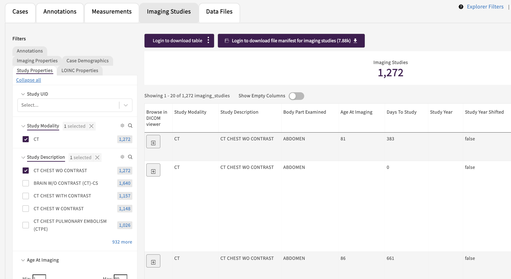

# DICOM Viewer integration

- [Overview](#overview)
- [Deployment](#deployment)
  - [Services](#services)
  - [Authorization](#authorization)
  - [Portal explorer integration](#portal-explorer-integration)
- [Submission](#submission)
- [Developer notes](#developer-notes)

## Overview

We use the [Ohif viewer](https://ohif.org) for the frontend and the [Orthanc server](https://www.orthanc-server.com) for the backend.

- [Ohif viewer fork](https://github.com/uc-cdis/viewers)
  - The viewer is accessible in Gen3 at `<Gen3 portal hostname>/ohif-viewer`, so the `PUBLIC_URL` environment variable must be set to `/ohif-viewer` ([a3f7848](https://github.com/OHIF/Viewers/commit/a3f7848b2f00721a5f4ab994754d828fd00cdfb2)). It can only be set at build time, so the only option was to fork the repository and build the image ourselves ([5c5c48a](https://github.com/OHIF/Viewers/commit/5c5c48ac19e4294c38b8bb03691e1b4250c432ba)).
  - We use Ohif viewer v3.
- [Orthanc server fork](https://github.com/uc-cdis/OrthancDocker/tree/master-rebase)
  - The Orthanc server supports custom authorization filters. We forked the repository so we could add a [filter](https://github.com/uc-cdis/OrthancDocker/blob/gen3-0.1.2/orthanc-gen3/authz_filter.py) that communicates with the [Gen3 policy engine](https://github.com/uc-cdis/arborist) to check user authorization.
  - Orthanc supports various storage options. We are currently using PostgreSQL and investigating using AWS S3. An internal write-up can be found [here](https://docs.google.com/document/d/1QDf_xqwy1esGp1AV2D-or8R1PbMAx_YqMsWhbL0B3PM). Note that one of the two will likely not be maintained anymore in the future.

## Deployment

### Services

Add the DICOM viewer and **one** of the two DICOM server services to your deployment manifest:
```
"ohif-viewer": "707767160287.dkr.ecr.us-east-1.amazonaws.com/gen3/ohif-viewer:gen3-v3.8.0",
"dicom-server": "707767160287.dkr.ecr.us-east-1.amazonaws.com/gen3/gen3-orthanc:gen3-0.1.2",
"orthanc": "docker.io/osimis/orthanc:master",
```
- `ohif-viewer` is the frontend
- `dicom-server` is the backend set up to use PostgreSQL
- `orthanc` is the backend set up to use AWS S3

If your Gen3 deployment uses [cloud-automation](https://github.com/uc-cdis/cloud-automation), you can then set up the services by running:
- `gen3 kube-setup-dicom` to set up and deploy `ohif-viewer` and/or `orthanc` (if you have chosen this server).
- `gen3 kube-setup-dicom-server` to set up and deploy `dicom-server` (do not run this if you have not chosen this server).

The Ohif viewer configuration may need to be updated as follows:
- Edit `~/Gen3Secrets/g3auto/orthanc-s3/app-config.js`
- Make sure `wadoUriRoot` is set to "/dicom-server/wado" if using `dicom-server`, or "/orthanc/wado" if using `orthanc`.
- Similarly, set both `qidoRoot` and `wadoRoot` to "/dicom-server/dicom-web" if using `dicom-server`, or "/orthanc/dicom-web" if using `orthanc`.
- After making updates, run `kubectl delete secret orthanc-s3-g3auto && gen3 kube-setup-dicom`

Once the services are deployed and the [access configured](#authorization), after logging in as an authorized user, you should be able to access the services at:
- `ohif viewer`: `<Gen3 portal hostname>/ohif-viewer/viewer?StudyInstanceUIDs=<DICOM study ID>`
- `dicom-server`: `<Gen3 portal hostname>/dicom-server/app/explorer.html`
- `orthanc`: `<Gen3 portal hostname>/orthanc/app/explorer.html`

### Authorization

See [this doc](https://github.com/uc-cdis/fence/blob/f102fab/docs/additional_documentation/user.yaml_guide.md) for details on setting up authorization through a `user.yaml` file.

- For `ohif-viewer` and `dicom-server`:
  - End users need the following access to view files in the DICOM viewer:
    - service: "dicom-viewer"
    - method: "read"
    - resource: "/services/dicom-viewer/studies/\<DICOM study ID\>"
    - The recommended setup is to create a policy with access to all DICOM studies (resource "/services/dicom-viewer/studies") and grant it to all users, or to all logged in users.
  - Administrators need the following access to interact with the server API (such as to submit files):
    - service: "dicom-viewer"
    - method: "create"
    - resource: "/services/dicom-viewer"
- For `orthanc`: **in addition to** the above, add the following:
  - End users:
    - service: "orthanc"
    - method: "read"
    - resource: "/services/orthanc/studies" (note that per-study access is not supported at the moment)
  - Administrators:
    - service: "orthanc"
    - method: "create"
    - resource: "/services/orthanc"
  - This may change in the future. Internal notes can be found [here](https://ctds-planx.atlassian.net/browse/MIDRC-491?focusedCommentId=32788).

### Portal explorer integration

The explorer page of the portal can be configured to link to the DICOM viewer. The elastic search documents must have a field corresponding to the DICOM study ID.



Configure your explorer page tab as follows:
```
"explorerConfig": [
    {
      "tabTitle": "Imaging Studies",
      "table": {
        "enabled": true,
        "fields": [...],
        "dicomViewerId": "dicom_study_id",
        "dicomViewerUrl": "ohif-viewer",
        "dicomServerURL": "dicom-server",
        "linkFields": [
          "dicom_study_id"
        ]
      }
    }
]
```
- `dicomViewerId`: (optional) name of the field that corresponds to the DICOM study ID.
- `dicomViewerUrl`: (optional; default: "dicom-viewer") to override the path to the DICOM viewer.
  - Set to "ohif-viewer" if you're using the `ohif-viewer` service.
- `dicomServerURL`: (optional; default: "dicom-server") to override the path to the DICOM server.
  - Set to "dicom-server" if you're using the `dicom-server` service.
  - Set to "orthanc" if you're using the `orthanc` service.
- Use `linkFields` to display a button in the explorer table instead of the study ID as text.

See the [portal configuration docs](https://github.com/uc-cdis/data-portal/blob/master/docs/portal_config.md) for the latest details.

## Submission

```python
# depending on whether you use `dicom-server` or `orthanc`:
endpoint = "<Gen3 portal hostname>/dicom-server/instances"
endpoint = "<Gen3 portal hostname>/orthanc/instances"

gen3_access_token = ""
file_path = ""
if not file_path.lower().endswith(".dcm"):
  raise Exception(f"'{file_path}' is not a DICOM file")

with open(file_path, "r") as f:
  file_contents = f.read()

headers = {
  "Content-Type": "Application/DICOM"
  "Authorization" = f"Bearer {gen3_access_token}"
}
resp = requests.post(endpoint, data=file_contents, headers=headers)
if resp.status_code != 200:
  raise Exception(f"Unable to upload '{file_path}': {resp.status_code} - {resp.text}")
```

## Developer notes

- Orthanc: We used the `jodogne/orthanc` image when using PostgreSQL for storage, but when switching to AWS S3 storage, we were not able to get it working with this image, so we switched to the `osimis/osiris` image. This is why the deployment is different for `dicom-server` (PostgreSQL) and `orthanc` (S3).
- For `dicom-server`, the authorization checks are in our [custom authorization filter](https://github.com/uc-cdis/OrthancDocker/blob/gen3-0.1.2/orthanc-gen3/authz_filter.py).
- For `orthanc`, right now the authorization checks are [in revproxy](https://github.com/uc-cdis/cloud-automation/blob/f197889/kube/services/revproxy/gen3.nginx.conf/orthanc-service.conf). It should still be possible (and is preferable) to add the custom authorization filter above to this server: docs [here](https://book.orthanc-server.com/plugins/authorization.html).
