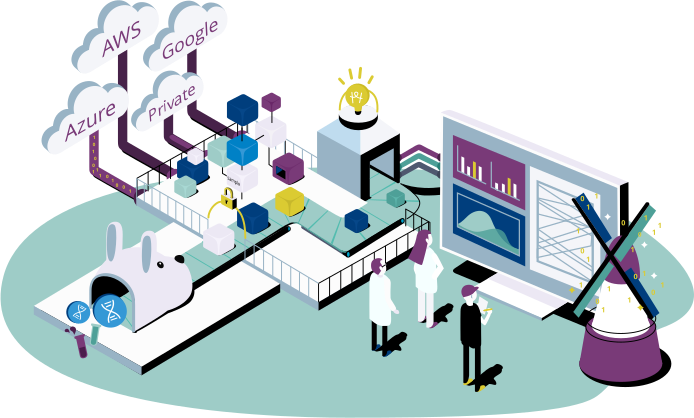
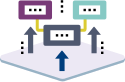

# Gen3 Products

The Gen3 platform consists of a collection of open source software services for building and managing cloud-based data resources, namely, interoperable nodes in a data ecosystem, data commons, and analysis workspaces.

Each of the Gen3 services is designed to accomplish a specific function in a data ecosystem, and that is achieved by providing a publicly-accessible application programming interface (API) that users, applications, and other services can send requests to.

This page organizes and presents the Gen3 software services in terms of the different types of data resources mentioned above.

## Gen3 Data Ecosystems

Data ecosystems consist of an interconnected network of data resources that are integrated by utilizing a common set of software services called the Gen3 Framework Services. These services support the emergence of data ecosystems by empowering data resources to interoperate through providing common protocols for user authentication and authorization, data indexing, and metadata services.
    button:
      link: /products/data-ecosystems

## Gen3 Framework Services

User authentication with data object and metadata indexing.
    button:
      link: /products/framework-services
    contents:
      c1:
        name: Object Indexing
        
      c2:
        name: AuthN/AuthZ
        
      c3:
        name: Metadata Service
        

## Gen3 Data Commons

Data management with web portal and integrated workspaces.
    button:
      link: /products/data-commons
    contents:
      c1:
        name: Data Portal
        
      c2:
        name: Data Search
        
      c3:
        name: Data Submission
        

## Gen3 Workspaces

Secure, cloud-based data analysis environments.
    button:
      link: /products/workspaces
    contents:
      c1:
        name: RStudio
        
      c2:
        name: Jupyter Notebooks
        
      c3:
        name: Custom Apps
        

## View the Gen3 Codebase

Visit the code repositories in GitHub
    button:
      caption: Learn
      link: https://github.com/uc-cdis

## Get Started Easily

View tutorials on using Gen3, including setup and configuration.
    button:
      caption: Easy Start
      link: /get-started
